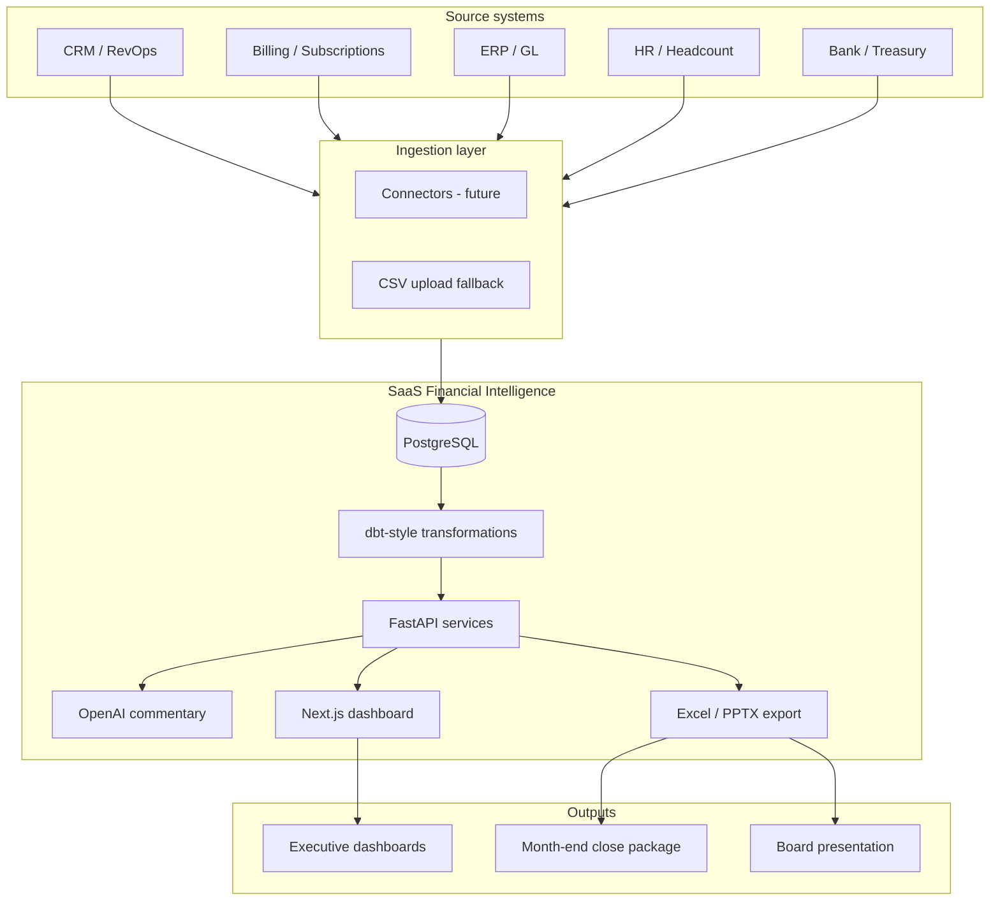

# Architecture Master

> **Product:** SaaS Financial Intelligence — a B2B SaaS FP&A and revenue intelligence layer.  
> **Not in scope:** ERP, general ledger posting, payroll, AP, or procurement.

## Purpose

Connect finance, RevOps, CRM, billing, ERP, and HR data into a single analytical layer for:

- Month-end close, management, and board reporting
- ARR/MRR, pipeline, and deferred revenue waterfalls
- Revenue, cash, and deferred revenue forecasting
- Variance commentary and export packages (Excel close, PowerPoint board)

The platform **reads and reconciles** source systems; it does not replace them.

---

## System context



---

## Technology stack

| Layer | Technology | Role |
|-------|------------|------|
| API | Python + FastAPI | REST services, validation, export orchestration |
| Database | PostgreSQL | Multi-tenant warehouse + transactional store |
| Frontend | Next.js + React | Dashboards, filters, export triggers |
| Transformations | dbt-style (planned / partial) | Staging → marts → reporting views |
| AI | OpenAI API | Draft variance and executive commentary |
| Ingestion (today) | Versioned CSV upload | Exact-header profiles; no manual mapping |
| Ingestion (future) | CRM, billing, ERP connectors | Scheduled sync into same warehouse schema |

---

## Repository layout

```
saas-financial-intelligence/
  docs/                          # Product & domain documentation (this folder)
  docker-compose.yml             # Local PostgreSQL
  backend/
    app/
      api/                       # Route modules (dashboard, waterfalls, export, …)
      models/                    # SQLAlchemy ORM (demo + warehouse tables)
      services/
        dashboard/               # Executive flow, waterfall attribution
        financial_statements/    # P&L, balance sheet, cash flow statement
        mrr/                     # MRR/ARR aggregation
        reporting/               # Marketing metrics, export, validation
        commentary/              # AI narrative inputs
        demo_csv/                # CSV detection and load
    alembic/                     # Schema migrations
    demo_data/                   # Bundled demo CSVs
    scripts/                     # Seed, warehouse sync, versioned CSV load
    docs/                        # Implementation notes (e.g. REPORTING_EXPORT.md)
  frontend/
    app/                         # Next.js pages
    components/                  # Dashboard cards (Executive Flow, exports, …)
```

**Documentation map**

| Document | Contents |
|----------|----------|
| [Architecture_Master.md](./Architecture_Master.md) | System design, boundaries, stack |
| [Data_Model.md](./Data_Model.md) | Entities, scenarios, warehouse tables |
| [Forecasting_Assumptions.md](./Forecasting_Assumptions.md) | Forecast drivers and roll-forward rules |
| [Close_Process.md](./Close_Process.md) | Month-end workflow and sign-off |
| [Reporting_Logic.md](./Reporting_Logic.md) | Report definitions and tie-out rules |

---

## Architectural principles

### 1. Source-of-truth waterfalls

Downstream metrics must reconcile to canonical waterfalls — never the reverse.

| Domain | Source of truth | Downstream consumers |
|--------|-----------------|-------------------|
| ARR movement | MRR/ARR waterfall | Pipeline closed-won checks, board ARR slides, revenue forecast |
| Cash forecasting | Cash flow bridge | Cash flow statement, balance sheet cash |
| Billings & revenue recognition | Deferred revenue waterfall | GAAP revenue forecast, P&L revenue lines |
| Pipeline movement | Pipeline waterfall | Opportunity drilldown, marketing funnel |
| New business ARR | MRR waterfall `new_arr` | Pipeline `closed_won` (must tie) |

### 2. Scenario model

Every reporting artifact supports:

- **Actual** — posted/submitted results for closed periods
- **Budget** — plan for the fiscal year
- **Forecast** — rolling operational forecast
- **Combined** — Actual through close month, Forecast thereafter (configurable cutover)

Actual ending balances roll into Forecast beginning balances for the next open period.

### 3. Multi-tenancy

All warehouse and demo tables are keyed by `organization_id`. API routes require `organization_id` on every query.

### 4. Validation before export

Exports aggregate `ValidationCheck` results from executive flow and financial statements. Optional `block_on_failure=true` returns HTTP 409 when checks fail.

### 5. API-first reporting

Dashboards and Excel/PPTX exports read the **same** service layer. No duplicate business logic in the frontend or export templates.

---

## Service boundaries

```mermaid
flowchart LR
  subgraph ingest_svc [Ingestion]
    DemoCSV[demo_csv]
    Warehouse[warehouse_csv_rows]
  end

  subgraph core [Core analytics]
    Waterfall[waterfall_service]
    FS[financial_statement_service]
    MRR[mrr services]
    Marketing[marketing_metrics_service]
    Pipeline[pipeline / opportunity services]
  end

  subgraph forecast [Forecasting]
    Drivers[driver_forecast]
    GAAP[gaap_revenue_forecast_service]
  end

  subgraph deliver [Delivery]
    Executive[executive-flow]
    Commentary[commentary + OpenAI]
    Export[reporting/export]
  end

  ingest_svc --> core
  core --> forecast
  core --> deliver
  forecast --> deliver
```



| Service area | Primary endpoints | Notes |
|--------------|-------------------|-------|
| Ingestion | `/api/v1/demo-csv/*`, `/api/v1/organizations/*` | Header-exact CSV profiles |
| Waterfalls | `/api/v1/waterfalls/{arr,pipeline,deferred-revenue,cash-flow}` | Attribution sub-routes for drilldown |
| Financial statements | `/api/v1/financial-statements/*` | P&L, BS, CF statement + validation |
| Executive | `/api/v1/dashboard/executive-flow` | Bundles waterfalls + KPIs + validation |
| Marketing | `/api/v1/marketing/*` | Channel and spend efficiency |
| Export | `/api/v1/export/*` | See `backend/docs/REPORTING_EXPORT.md` |

---

## Data flow (happy path)

1. **Load** — CSV or connector writes raw/staging tables (`customers`, `subscriptions`, `mrr_waterfall`, versioned `actual_*` / `budget_*` / `forecast_*` warehouse tables).
2. **Transform** — dbt-style jobs normalize periods, map movement types, and build mart views (in progress; some logic lives in SQLAlchemy services today).
3. **Serve** — FastAPI services query marts and return Pydantic schemas shared by UI and export.
4. **Validate** — Tie-out checks run per period/scenario (balance sheet balances, bridge ending cash = BS cash, closed won = new ARR, etc.).
5. **Present** — Next.js dashboards and optional AI commentary.
6. **Export** — xlsxwriter / python-pptx build close and board packages from the same bundle.

---

## AI layer

OpenAI is used for **narrative assistance only**:

- Variance commentary drafts (metric context from API comparisons)
- Executive summary bullets on board slides

AI does not compute financial numbers. All figures in commentary templates are sourced from API metrics.

---

## Security & compliance (starter)

| Topic | Direction |
|-------|-----------|
| Authentication | To be added (org-scoped API keys or SSO) |
| PII | Minimize retention; CRM fields used only for attribution |
| Audit trail | Version CSV uploads; retain `warehouse_csv_rows` metadata |
| SOC2 | Design for tenant isolation at DB and API layers |

---

## Roadmap hooks

- [ ] Live connectors (Salesforce, Stripe, NetSuite, etc.) → same warehouse schema as CSV
- [ ] dbt project repo or `backend/transform/` with documented lineage
- [ ] Scheduled close snapshots (immutable period locks)
- [ ] Role-based access (Finance vs RevOps vs Board viewer)
- [ ] Webhook notifications when validation fails pre-export

---

## Related reading

- Local dev: [../README.md](../README.md)
- Export implementation: [../backend/docs/REPORTING_EXPORT.md](../backend/docs/REPORTING_EXPORT.md)
- Tie-out rules: [Reporting_Logic.md](./Reporting_Logic.md)
