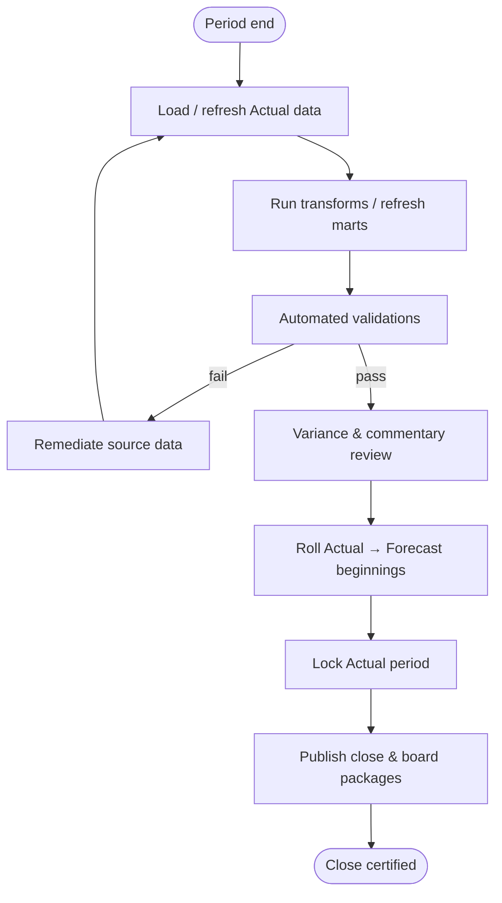

# Close Process

> Month-end close workflow for B2B SaaS finance teams using this platform.  
> The platform supports close **reporting and reconciliation** — not GL posting or subledger close in the ERP.

## Objectives

By the end of each close cycle, finance and RevOps should be able to:

1. Certify Actual data for the closed month (`as_of_period`)
2. Pass all automated tie-out validations
3. Publish management and board packages
4. Roll Actual endings into the next Forecast period
5. Leave an audit trail of sources and variances

---

## Close calendar (typical B2B SaaS)

| Day (T+) | Activity | Platform touchpoints |
|----------|----------|----------------------|
| T+1 | Subledger sync (billing, CRM) | CSV upload or connectors |
| T+2 | GL actuals load | `gl_actuals` / `actual_*` income statement |
| T+3 | MRR & deferred revenue true-up | `mrr_waterfall`, deferred revenue waterfall |
| T+4 | Preliminary validation | `/financial-statements/validation`, `/export/validation` |
| T+5 | Variance review with department owners | Variance commentary workbook |
| T+6 | Forecast roll-forward | [Forecasting_Assumptions.md](./Forecasting_Assumptions.md) |
| T+7 | Management review meeting | `management-review.xlsx` |
| T+8–10 | Board materials | `board-presentation.pptx` |

Adjust SLAs to your company (e.g. 5-business-day close).

---

## Roles & responsibilities

| Role | Responsibilities in platform |
|------|------------------------------|
| **Controller** | Signs off balance sheet balance, BS cash = bridge cash |
| **FP&A** | Owns Budget/Forecast scenarios, drivers, Combined cutover |
| **RevOps** | Owns pipeline waterfall, opportunity drilldown, closed won vs new ARR |
| **Accounting** | Owns deferred revenue waterfall vs ERP subledger |
| **Treasury** | Owns cash bridge and cash flow statement tie |
| **Marketing ops** | Owns marketing pipeline actuals |
| **CFO / exec sponsor** | Approves export packages for board |

---

## Close workflow



---

## Step-by-step runbook

### 1. Confirm scope

Set global filters (used by API and exports):

| Parameter | Example | Notes |
|-----------|---------|-------|
| `organization_id` | UUID | Tenant |
| `scenario` | `Actual` for close; `Combined` for board |
| `start_period` | `2026-01` | Fiscal YTD start |
| `end_period` | `2026-12` | Full year view |
| `as_of_period` | `2026-05` | Close month anchor |

### 2. Ingest Actual sources

Minimum datasets for a full close package:

| Priority | Dataset | Table / CSV profile |
|----------|---------|---------------------|
| P0 | GL actuals | `gl_actuals`, `actual_income_statement` |
| P0 | MRR waterfall | `mrr_waterfall` / `actual_mrr_waterfall` |
| P0 | Cash bridge | `actual_operating_cash_flow_bridge` |
| P0 | Balance sheet | `actual_balance_sheet` |
| P0 | Deferred revenue waterfall | `actual_deferred_revenue_waterfall` |
| P1 | Pipeline waterfall | `actual_pipeline_waterfall` |
| P1 | Opportunities | `opportunities` |
| P1 | Marketing | `actual_marketing_pipeline` |
| P2 | Headcount actuals | `headcount_plan` (Actual version) |

Use:

```powershell
cd backend
python scripts\sync_warehouse_schema.py "<csv-folder>"
python scripts\load_versioned_csvs.py <organization_id> "<csv-folder>"
```

Or dashboard CSV upload for demo profiles.

### 3. Run validation pre-check

Before distributing Excel:

```http
GET /api/v1/export/validation?organization_id=...&scenario=Combined&start_period=2026-01&end_period=2026-12&as_of_period=2026-05
```

Optional hard stop on export:

```http
GET /api/v1/export/month-end-close.xlsx?...&block_on_failure=true
```

Returns **409** if any check has `status=fail`.

Key validations (see [Reporting_Logic.md](./Reporting_Logic.md)):

- Balance sheet balances (`assets = liabilities + equity`)
- Cash bridge ending cash = balance sheet cash
- Cash flow statement ties to cash bridge
- Closed won pipeline = new business ARR (MRR waterfall)
- Opportunity movements reconcile to pipeline waterfall
- Deferred waterfall roll-forward

### 4. Variance commentary

1. Export `variance-commentary.xlsx` or use month-end close tab **Variance Commentary**.
2. Review auto-filled **Metric Context** column (Actual vs Budget vs Forecast).
3. Owners complete narrative columns; optional AI draft via `include_ai_commentary=true`.
4. Controller approves material variances (> threshold per policy).

### 5. Management review

- Export `management-review.xlsx` (executive subset).
- Review Executive Flow dashboard: waterfalls, KPI scorecard, GAAP revenue forecast.
- Document decisions that require Forecast driver updates.

### 6. Roll forward to Forecast

After Actual for `as_of_period` is certified:

1. Copy ending balances → next period Forecast beginnings ([Forecasting_Assumptions.md](./Forecasting_Assumptions.md)).
2. Refresh `forecast_mrr_waterfall` opening ARR from Actual ending ARR.
3. Re-run forecast build sequence (drivers → bridges → statements).
4. Set Combined scenario cutover to `as_of_period`.

### 7. Board package

- Export `board-presentation.pptx`.
- Slides include canonical KPIs, pipeline/GAAP/validation summary.
- Attach validation slide — board expects green or explained warnings only.

### 8. Lock and archive

| Artifact | Storage recommendation |
|----------|------------------------|
| `month-end-close.xlsx` | SharePoint / Google Drive close folder |
| `board-presentation.pptx` | Board portal |
| Validation JSON | `close/2026-05/validation.json` export |
| CSV manifests | Git tag or object storage snapshot |

Future: immutable `close_snapshots` table in Postgres.

---

## Sign-off matrix

| Control | Owner | Evidence |
|---------|-------|----------|
| GL ties to TB | Controller | ERP trial balance vs `gl_actuals` |
| ARR waterfall complete | RevOps + FP&A | Validation: movements sum to ending ARR |
| Pipeline ↔ CRM | RevOps | Opportunity drilldown sample |
| Deferred revenue ↔ subledger | Accounting | ERP deferred report vs waterfall |
| Cash ↔ bank | Treasury | Bank statement vs bridge ending cash |
| Forecast roll-forward | FP&A | Beginning balance check vs prior Actual ending |
| Export package | CFO | Signed validation tab + commentary |

---

## Exception handling

| Situation | Action |
|-----------|--------|
| Validation **fail** | Do not publish with `block_on_failure`; fix source CSV or ERP extract |
| Validation **warning** | Document in variance commentary; acceptable for draft review |
| Missing Budget column | Check **Data Sources & Gaps** tab in export |
| CRM out of sync | Re-export opportunities; re-run pipeline waterfall |
| Late invoice affecting deferred | Re-load billing CSV; rebuild deferred waterfall |

---

## Deliverables checklist

- [ ] Actual data loaded for `as_of_period`
- [ ] All P0 validations pass (or documented exceptions)
- [ ] Variance commentary completed by owners
- [ ] Forecast roll-forward completed
- [ ] `month-end-close.xlsx` distributed
- [ ] `management-review.xlsx` reviewed in staff meeting
- [ ] `board-presentation.pptx` sent to board portal
- [ ] Validation JSON archived
- [ ] Period lock requested in ERP (outside platform)

---

## Platform commands (quick reference)

```powershell
# Backend
cd backend
python -m uvicorn app.main:app --reload --port 8000

# Tests before close sign-off
python -m pytest tests/test_reporting_export.py tests/test_financial_statement_reporting.py -q
```

See [../backend/docs/REPORTING_EXPORT.md](../backend/docs/REPORTING_EXPORT.md) for export endpoint details.

---

## Related documents

- [Reporting_Logic.md](./Reporting_Logic.md) — tie-out definitions
- [Data_Model.md](./Data_Model.md) — required tables
- [Architecture_Master.md](./Architecture_Master.md) — system boundaries
