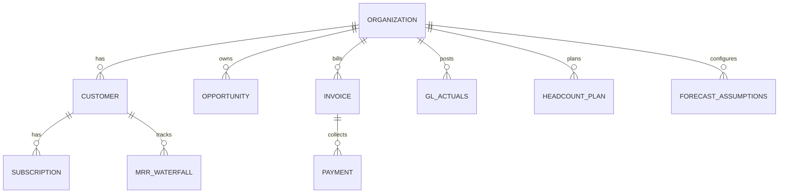

# Data Model

> Canonical reference for entities, scenarios, warehouse tables, and lineage.  
> Aligns with `backend/app/models/` and versioned CSV warehouse loaders.

## Design goals

1. **Multi-tenant** — every fact table includes `organization_id`.
2. **Scenario-aware** — Actual, Budget, and Forecast versions of the same logical dataset where applicable.
3. **Waterfall-first** — ARR, pipeline, deferred revenue, and cash bridge tables are first-class facts, not derived-only views.
4. **Traceable** — validation checks record `source_tables_used` for each tie-out.

---

## Entity relationship overview



---

## Core dimensions

| Entity | Table | Grain | Key fields |
|--------|-------|-------|------------|
| Organization | `organizations` | 1 row per tenant | `id` (UUID), `name` |
| Customer | `customers` | Per org | `customer_id`, segment, region |
| Subscription | `subscriptions` | Per customer × product | `subscription_id`, start/end, ACV/MRR |
| Opportunity | `opportunities` | Per deal | `opportunity_id`, stage, owner, amount |
| Employee / role | `headcount_plan` | Per period × dept | FTE, role, cost center |

---

## Transactional / operational facts (demo layer)

Loaded via `POST /api/v1/demo-csv/upload` or `seed` from `backend/demo_data/`.

| Table | Purpose | Typical source |
|-------|---------|----------------|
| `customers` | Account master | CRM |
| `subscriptions` | Contract terms | Billing |
| `opportunities` | Pipeline deals | CRM |
| `invoices` | Billings | Billing |
| `payments` | Cash collections | Billing / bank |
| `gl_actuals` | GL detail by dept/account | ERP |
| `headcount_plan` | Actual & budget headcount | HR / finance plan |
| `vendor_contracts` | Committed spend | Procurement export |
| `sales_quotas` | Quota capacity | RevOps |
| `commission_plans` | Comp rules | HR / finance |
| `mrr_waterfall` | **Customer-level MRR movements** | Billing + CS (feeds ARR waterfall) |

### MRR waterfall grain

`mrr_waterfall` is keyed by:

- `organization_id`, `period`, `customer_id`, `movement_type`

Movement types include: `new_mrr`, `expansion_mrr`, `contraction_mrr`, `churn_mrr`, `reactivation_mrr`, with `beginning_mrr` / `ending_mrr` for roll-forward.

**Rule:** Aggregated ARR waterfall in reporting is derived from this table (or its versioned Actual/Budget/Forecast counterparts). See [Reporting_Logic.md](./Reporting_Logic.md).

---

## Versioned warehouse (Actual / Budget / Forecast)

Loaded via `scripts/load_versioned_csvs.py` into scenario-specific tables. Naming convention:

| Pattern | Example tables |
|---------|----------------|
| `actual_*` | `actual_income_statement`, `actual_balance_sheet`, `actual_mrr_waterfall` |
| `budget_*` | `budget_income_statement`, `budget_mrr_waterfall`, … |
| `forecast_*` | `forecast_income_statement`, `forecast_mrr_waterfall`, … |

`warehouse_csv_rows` stores raw row metadata for audit (file name, profile, load timestamp).

### Financial statement facts

| Logical report | Actual table | Budget table | Forecast table |
|----------------|--------------|--------------|----------------|
| Income statement | `actual_income_statement` | `budget_income_statement` | `forecast_income_statement` |
| Balance sheet | `actual_balance_sheet` | `budget_balance_sheet` | `forecast_balance_sheet` |
| Cash flow statement | `actual_cash_flow_statement` | `budget_cash_flow_statement` | `forecast_cash_flow_statement` |

Period column: `YYYY-MM` (date or string normalized in services).

### Waterfall facts (versioned)

| Waterfall | Actual | Budget | Forecast |
|-----------|--------|--------|----------|
| MRR / ARR | `actual_mrr_waterfall` | `budget_mrr_waterfall` | `forecast_mrr_waterfall` |
| Pipeline | `actual_pipeline_waterfall` | `budget_pipeline_waterfall` | `forecast_pipeline_waterfall` |
| Deferred revenue | `actual_deferred_revenue_waterfall` | `budget_deferred_revenue_waterfall` | `forecast_deferred_revenue_waterfall` |
| Cash flow bridge | `actual_operating_cash_flow_bridge` | `budget_operating_cash_flow_bridge` | `forecast_operating_cash_flow_bridge` |

### Marketing facts

| Table | Scenarios |
|-------|-----------|
| `actual_marketing_pipeline` | Actual |
| `budget_marketing_pipeline` | Budget |
| `forecast_marketing_pipeline` | Forecast |

Unified reporting view: `marketing.actual_budget_forecast` (service-layer abstraction).

---

## Forecast-specific tables

Defined in `demo_finance.py` for driver-based and operational forecast inputs:

| Table | Purpose |
|-------|---------|
| `forecast_assumptions` | Global forecast parameters |
| `forecast_driver_assumptions` | Named drivers (growth %, churn, DSO, etc.) |
| `forecast_bookings_summary` | Bookings roll-up by period |
| `forecast_revenue_schedule` | Revenue timing / recognition schedule |
| `forecast_deferred_revenue_waterfall` | **Source of truth** for forecast billings & rev rec |
| `forecast_operating_cash_flow_bridge` | **Source of truth** for forecast cash |
| `forecast_cash_collections` | Collections timing from billings |
| `forecast_working_capital_metrics` | AR, AP, deferred balance drivers |
| `forecast_opportunities` | Forward pipeline for waterfall |
| `forecast_mrr_waterfall` | Forward ARR bridge |
| `forecast_headcount_plan` | Forward opex from hiring |
| `forecast_marketing_pipeline` | Forward funnel/spend |

See [Forecasting_Assumptions.md](./Forecasting_Assumptions.md) for how drivers populate these tables.

---

## Transformation layers (dbt-style)

Target layering (implement incrementally):

```
sources/          # Raw CSV + connector landing
staging/          # Typed, deduped, period-normalized
intermediate/     # Customer-period rolls, movement unpivot
marts/
  fct_mrr_waterfall_period
  fct_arr_waterfall_period      # MRR × 12, movement labels for ARR
  fct_pipeline_waterfall_period
  fct_deferred_revenue_period
  fct_cash_flow_bridge_period
  dim_customer
  dim_opportunity
reporting/        # Wide views for API services
```

**Today:** much mart logic lives in `backend/app/services/dashboard/` and `financial_statements/`. Migrate heavy SQL into transform project over time without changing API contracts.

---

## Period and scenario conventions

| Field | Format | Notes |
|-------|--------|-------|
| `period` | `YYYY-MM` or `date` (first of month) | Services normalize to `YYYY-MM` in API responses |
| `scenario` | `Actual` \| `Budget` \| `Forecast` \| `Combined` | Combined = Actual through close month, then Forecast |
| `as_of_period` | `YYYY-MM` | Anchor for MTD/QTD/YTD in exports |
| `version` (GL) | `Actual` \| `Budget` | On `gl_actuals` rows |

### Actual → Forecast roll-forward

For balance sheet and bridge tables:

```
forecast.beginning_balance(period P) = actual.ending_balance(P - 1)
```

When Actual for `P - 1` is not yet posted, use last closed Actual or carry Forecast chain — document the rule per metric in [Forecasting_Assumptions.md](./Forecasting_Assumptions.md).

---

## Key measures (definitions)

| Measure | Definition | Primary table |
|---------|------------|---------------|
| MRR | Monthly recurring revenue at period end | `mrr_waterfall` / ARR mart |
| ARR | MRR × 12 (or sum of ACV for annual contracts — document org policy) | ARR waterfall |
| New ARR | `new_arr` movement in ARR waterfall | Ties to pipeline `closed_won` |
| Billings | Invoices issued in period | `invoices` / deferred waterfall |
| GAAP revenue | Recognized revenue per schedule | Deferred revenue waterfall + `forecast_revenue_schedule` |
| Ending cash | Balance sheet cash line | Must equal cash bridge ending cash |
| Net new ARR | New + expansion − contraction − churn (+ reactivation) | ARR waterfall |

---

## Opportunity ↔ pipeline linkage

| Pipeline movement | Opportunity drilldown filter |
|-------------------|-------------------------------|
| `new` | Created in period |
| `progression` | Stage/value change |
| `closed_won` | Won in period — **must tie MRR `new_arr`** |
| `closed_lost` | Lost in period |
| `slipped` | Close date pushed |

Drilldown service: `pipeline_opportunity_drilldown_service.py` — returns opportunities per `waterfall_type`.

---

## Data quality metadata

Each load should capture (extend as needed):

| Attribute | Where |
|-----------|-------|
| Source file name | `warehouse_csv_rows` |
| Profile / detector match | `demo_csv/detector.py` |
| Row count | Upload API response |
| Load user / timestamp | Future: `ingestion_runs` table |

---

## CSV header contract

Upload accepts **exact** header sets per profile — no column mapping UI. Mismatches return HTTP 400 with `missing` / `extra` columns per profile.

Maintain a machine-readable manifest (future: `docs/csv_profiles.yaml`) synced with:

- `backend/demo_data/*.csv`
- `scripts/sync_warehouse_schema.py`

---

## Indexes and performance (guidelines)

- Composite indexes on `(organization_id, period)` for all fact tables
- Filter indexes on `movement_type`, `waterfall_type`, `scenario_name`
- Partition large tenants by `organization_id` + `period` range when row counts exceed ~10M

---

## Related documents

- Tie-out rules: [Reporting_Logic.md](./Reporting_Logic.md)
- Close workflow: [Close_Process.md](./Close_Process.md)
- Architecture: [Architecture_Master.md](./Architecture_Master.md)
