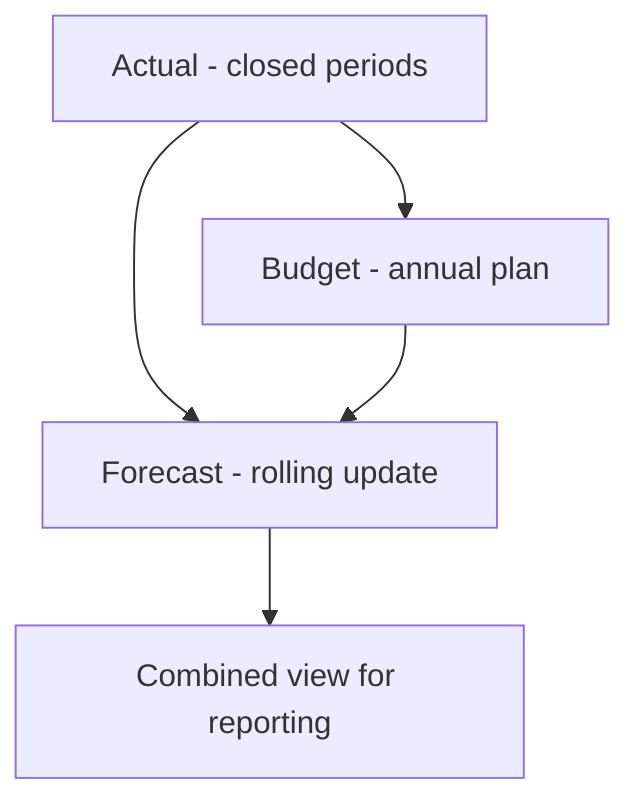
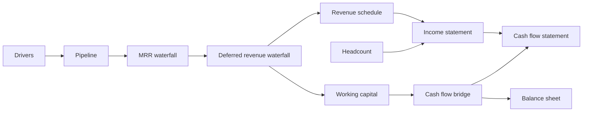

# Forecasting Assumptions

> How forward-looking scenarios are built, which tables they write to, and how they connect to Actuals at period close.

## Scope

This document covers **operational and financial forecasting** inside the platform:

- Revenue and ARR (MRR waterfall)
- Pipeline and bookings
- Deferred revenue and GAAP revenue
- Cash collections and cash flow bridge
- Headcount-driven opex
- Marketing funnel and spend

It does **not** define accounting policy for your ERP — assumptions here drive **management and board** forecasts that must reconcile to waterfalls.

---

## Scenario hierarchy



| Scenario | Update cadence | Typical owner |
|----------|----------------|---------------|
| **Budget** | Annual (+ mid-year refresh) | FP&A |
| **Forecast** | Monthly or weekly | FP&A + RevOps |
| **Actual** | Month-end close | Accounting |
| **Combined** | Derived | System (cutover at `as_of_period`) |

---

## Roll-forward rule (critical)

> **Actual ending balances become Forecast beginning balances** for the first open forecast period.

Applies to:

- Balance sheet line items (cash, AR, deferred revenue, AP, prepaid)
- MRR/ARR waterfall beginning ARR
- Deferred revenue waterfall beginning balance
- Cash flow bridge beginning cash
- Pipeline opening pipeline (by stage bucket, if modeled)

### Pseudocode

```
close_month = as_of_period  # e.g. 2026-05

for each balance_sheet_line L:
  forecast[L].beginning(close_month + 1) = actual[L].ending(close_month)

for each bridge B:
  forecast[B].beginning_cash(close_month + 1) = actual[B].ending_cash(close_month)
```

If Actual for `close_month` is not yet posted, Forecast may temporarily chain from prior Forecast month — flag with validation warning `actual_not_posted_for_rollforward`.

---

## Source-of-truth by forecast domain

| Forecast output | Source of truth table / logic | Do not override from |
|-----------------|------------------------------|----------------------|
| ARR movement | `forecast_mrr_waterfall` | P&L revenue alone |
| Billings & rev rec | `forecast_deferred_revenue_waterfall` | Invoice table without bridge |
| Cash position | `forecast_operating_cash_flow_bridge` | Income statement net income alone |
| Pipeline ARR | `forecast_opportunities` + pipeline waterfall | CRM snapshot without waterfall tie |
| GAAP revenue timing | `forecast_revenue_schedule` | Must reconcile to deferred waterfall |

---

## Driver catalog

Stored primarily in `forecast_driver_assumptions` and `forecast_assumptions`.

### Revenue & subscriptions

| Driver | Example values | Feeds |
|--------|----------------|-------|
| `new_logo_arr_growth_pct` | 8% QoQ | New ARR in MRR waterfall |
| `expansion_rate_pct` | 12% of base ARR | Expansion movement |
| `gross_churn_rate_pct` | 1.5% monthly | Churn movement |
| `net_revenue_retention` | 108% | Sanity check vs waterfall |
| `contract_term_months` | 12 / 24 / 36 | ARR vs MRR conversion |
| `ramp_months` | 0–3 | Revenue schedule delay |

### Pipeline & bookings

| Driver | Feeds |
|--------|-------|
| `win_rate_by_stage` | Pipeline → closed_won |
| `avg_sales_cycle_days` | Slip / progression timing |
| `asp_by_segment` | Opportunity amounts |
| `quota_attainment_pct` | `forecast_quota_capacity` |
| `pipeline_coverage_ratio` | Board KPI checks |

**Tie-out:** Sum of `closed_won` in pipeline waterfall = `new_arr` in MRR waterfall (per period, per scenario). See [Reporting_Logic.md](./Reporting_Logic.md).

### Deferred revenue & billings

| Driver | Feeds |
|--------|-------|
| `billings_growth_pct` | New billings in deferred waterfall |
| `recognition_pattern` | Straight-line / ratable / milestone |
| `deferred_revenue_days` | Working capital on cash bridge |
| `professional_services_pct` | Non-ratable portion |

### Cash

| Driver | Feeds |
|--------|-------|
| `dso_days` | Change in AR on bridge |
| `dpo_days` | Change in AP |
| `collection_lag_days` | `forecast_cash_collections` |
| `capex_monthly` | Investing section (when modeled) |
| `minimum_cash_balance` | Board liquidity slide |

**Tie-out:** Bridge `ending_cash` = balance sheet cash. Cash flow **statement** ties to bridge totals.

### Headcount & opex

| Driver | Feeds |
|--------|-------|
| `hires_per_month_by_dept` | `forecast_headcount_plan` |
| `avg_fully_loaded_cost` | GL salary & benefits lines |
| `attrition_rate_pct` | Headcount reductions |
| `bonus_accrual_pct` | Variable comp in P&L |

### Marketing

| Driver | Feeds |
|--------|-------|
| `marketing_spend_monthly` | `forecast_marketing_pipeline` |
| `cost_per_lead` | Top-of-funnel volume |
| `mql_to_sql_rate` | Funnel conversion |
| `sql_to_opp_rate` | Pipeline creation |
| `cac_payback_months` | Efficiency KPIs |

---

## Forecast build sequence (recommended)

Run in dependency order when regenerating a forecast scenario:

1. **Update drivers** — `forecast_driver_assumptions` for the active `scenario_name` (default `Forecast`).
2. **Pipeline** — `forecast_opportunities` → pipeline waterfall movements.
3. **Bookings / ARR** — Apply win rates and ASP → `forecast_bookings_summary` → `forecast_mrr_waterfall`.
4. **Billings** — Contract terms → `forecast_deferred_revenue_waterfall`.
5. **Revenue recognition** — `forecast_revenue_schedule` (must match deferred waterfall recognized amount).
6. **Working capital** — DSO/DPO/deferred changes → `forecast_working_capital_metrics`.
7. **Cash bridge** — Collections, opex, WC → `forecast_operating_cash_flow_bridge`.
8. **Financial statements** — Roll P&L, BS, CF statement from above (not independent guesses).
9. **Headcount** — Refresh salary lines in `forecast_income_statement`.
10. **Validate** — Run `/api/v1/financial-statements/validation` and export pre-check.



---

## AI-assisted assumptions (guardrails)

OpenAI may **suggest** narrative explanations for forecast changes but must not silently alter driver tables.

If adding “assumption chat” features:

- Propose edits as a structured diff against `forecast_driver_assumptions`
- Require FP&A approval before persisting
- Log before/after values for audit

---

## Versioning and locks

| State | Behavior |
|-------|----------|
| **Draft forecast** | Editable drivers; validation warnings allowed |
| **Submitted forecast** | Board/management baseline; snapshot tables |
| **Locked actual** | No overwrites to `actual_*` for closed periods |

Implement period locks as a future `period_close_status` table per `organization_id` + `period`.

---

## Example: monthly forecast refresh checklist

- [ ] Post Actual for prior month (or confirm still open)
- [ ] Roll forward beginning balances into Forecast month 1
- [ ] RevOps updates pipeline (`forecast_opportunities`)
- [ ] FP&A updates churn/expansion drivers
- [ ] Regenerate deferred revenue and cash bridge
- [ ] Reconcile P&L revenue to deferred waterfall recognized
- [ ] Run validation suite; resolve failures before board export
- [ ] Export Combined scenario workbook for management review

---

## Related documents

- Data tables: [Data_Model.md](./Data_Model.md)
- Tie-outs: [Reporting_Logic.md](./Reporting_Logic.md)
- Close calendar: [Close_Process.md](./Close_Process.md)
