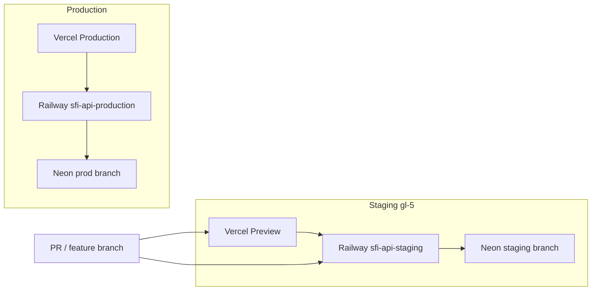

# gl-5 — Staging environment + smoke tests before prod

**Goal:** Every change that touches auth, billing, entitlements, or ingest is validated on **staging** (Neon branch + Railway staging API + Vercel Preview) before merging to production.

**Production (reference):**

| Layer | URL |
|-------|-----|
| Frontend | https://smpl-financial-intelligence.vercel.app |
| API | https://sfi-api-production.up.railway.app |
| DB | Neon production branch (`AUTH_DATABASE_URL` on Vercel Production) |

---

## Architecture



**Rule:** Preview deployments must **never** call the production API or production Neon branch.

---

## Checklist (gl-5a → gl-5c)

### gl-5a — Neon staging branch + Railway staging API

1. **Neon — create staging branch**
   - Neon console → your project → **Branches** → **Create branch** (e.g. `staging` from `main`).
   - Copy the branch connection string (`postgresql://…@ep-….neon.tech/…`).

2. **Railway — duplicate backend service**
   - Same Railway project → **New service** → deploy from repo (`backend/` root, same as production).
   - Name it e.g. `sfi-api-staging`.
   - Set variables (Railway dashboard or CLI linked to staging service):

   | Variable | Value |
   |----------|--------|
   | `DATABASE_URL` | Neon **staging** branch (`postgresql+psycopg://…`) |
   | `API_CORS_ORIGINS` | `http://localhost:3002,https://smpl-financial-intelligence.vercel.app` plus your Preview URL after first deploy |
   | `BILLING_INTERNAL_API_KEY` | Same as prod (or separate test key) |

   Tip: from repo root after `cd backend && npx @railway/cli link` (select **staging** service):

   ```powershell
   .\scripts\set-railway-backend-env.ps1 -DatabaseUrl "postgresql://...@ep-STAGING.neon.tech/neondb?sslmode=require"
   ```

   Then add Preview origin(s) to `API_CORS_ORIGINS` manually (Vercel preview URLs look like `https://smpl-financial-intelligence-git-<branch>-smplai.vercel.app`).

3. **Public domain**
   - Railway → staging service → **Settings → Networking** → generate domain (e.g. `sfi-api-staging.up.railway.app`).

4. **Migrations / seed on staging branch**
   - Run once against staging `DATABASE_URL` (local shell or Railway shell):

   ```powershell
   cd backend
   $env:DATABASE_URL = "postgresql+psycopg://...@ep-STAGING..."
   .\.venv312\Scripts\python.exe -m alembic upgrade head
   ```

   Optional: copy demo org data from prod using your existing warehouse/provision scripts with `-OrganizationId` on staging only.

5. **Verify API**

   ```powershell
   .\scripts\save-staging-config.ps1 `
     -ApiBase "https://sfi-api-staging-xxxx.up.railway.app" `
     -DatabaseUrl "postgresql://...@ep-STAGING.neon.tech/neondb?sslmode=require"

   .\scripts\verify-staging-stack.ps1
   ```

   Expect `/health` with `plan_entitlements: true` and `/health/db` → `connected`.

---

### gl-5b — Vercel Preview → staging API + staging DB

1. **Preview env vars** (Vercel → Project → Settings → Environment Variables → **Preview**):

   | Variable | Value |
   |----------|--------|
   | `SFI_BACKEND_URL` | Railway staging API URL |
   | `NEXT_PUBLIC_API_URL` | Same as `SFI_BACKEND_URL` |
   | `AUTH_DATABASE_URL` | Neon **staging** branch (same as Railway `DATABASE_URL`) |
   | `AUTH_URL` | Leave unset for Preview (Vercel auto-uses deployment URL) or set per-branch |
   | Auth / Resend / Stripe | Use **test** keys where possible |

   CLI shortcut:

   ```powershell
   .\scripts\set-vercel-staging-env.ps1 -BackendUrl "https://sfi-api-staging-xxxx.up.railway.app"
   ```

   Set `AUTH_DATABASE_URL` for Preview in the dashboard (staging Neon URL).

2. **Deploy a Preview**
   - Push a branch or open a PR → Vercel builds Preview.
   - Copy the Preview URL → update `STAGING_FRONTEND_URL` in `frontend/.env.staging.local` (optional, for browser checks).

3. **Smoke login on Preview**
   - Open `https://<preview>/login` → magic link → `/app`.
   - Confirm dashboards load (calls staging API, not prod).

---

### gl-5c — Staging smoke suite before prod merge

Run before merging PRs that change backend auth, entitlements, billing, or ingest:

```powershell
.\scripts\smoke-test-staging.ps1
```

This runs:

1. `verify-staging-stack.ps1` — `/health`, `/health/db`, optional `/login` on Preview
2. `smoke-test-plan-entitlements.ps1` — plan gates on staging DB + staging API (restores demo org plan after)

**Prod merge gate:** green staging smoke + your usual review. After merge to `main`, Railway/Vercel Production auto-deploy; optionally re-run prod smoke:

```powershell
.\scripts\verify-railway-gl3-deploy.ps1
.\scripts\smoke-test-plan-entitlements.ps1
```

---

## Local config (gitignored)

Save once after gl-5a:

```powershell
.\scripts\save-staging-config.ps1 `
  -ApiBase "https://sfi-api-staging-xxxx.up.railway.app" `
  -DatabaseUrl "postgresql://...@ep-STAGING.neon.tech/neondb?sslmode=require" `
  -FrontendUrl "https://smpl-financial-intelligence-git-main-smplai.vercel.app"
```

Creates `frontend/.env.staging.local`. Template: `scripts/config/staging.env.example`.

Scripts refuse to treat `sfi-api-production.up.railway.app` as staging unless you pass `-AllowProduction` (escape hatch only).

---

## Scripts reference

| Script | Purpose |
|--------|---------|
| `save-staging-config.ps1` | Save staging URLs locally |
| `set-vercel-staging-env.ps1` | Point Vercel **Preview** at staging API |
| `verify-staging-stack.ps1` | Health checks on staging stack |
| `smoke-test-staging.ps1` | Full gl-5 smoke before prod merge |
| `smoke-test-plan-entitlements.ps1` | `-ApiBase` / `-DatabaseUrl` for any environment |

---

## Workflow (recommended)

1. Feature branch → push → Vercel Preview + Railway staging auto-deploy (if staging tracks same branch) **or** manual redeploy staging service.
2. `.\scripts\smoke-test-staging.ps1`
3. Manual spot-check on Preview URL (login + one dashboard tab).
4. Merge PR → production deploy.
5. Quick prod `/health` + optional entitlements smoke.

---

## Troubleshooting

| Symptom | Fix |
|---------|-----|
| CORS error on Preview | Add exact Preview URL to Railway staging `API_CORS_ORIGINS` |
| Magic link works locally but not Preview | Preview `AUTH_DATABASE_URL` must be staging branch; Resend `AUTH_URL` / allowed domains |
| `/health/db` fails | Wrong `DATABASE_URL` on Railway staging; run migrations on staging branch |
| Staging smoke hits prod | Re-run `save-staging-config.ps1` with staging API URL |
| Empty dashboards on Preview | Seed staging DB or provision demo org on staging branch |

---

## Related docs

- `docs/DEPLOYMENT.md` — Phase 2 Railway + Vercel production
- `docs/GO_LIVE_GL1_CUSTOMER_PROVISIONING.md` — provision test org on staging
- `docs/GO_LIVE_POC_ONBOARDING.md` — ingest work should land on staging first (poc-1…)
