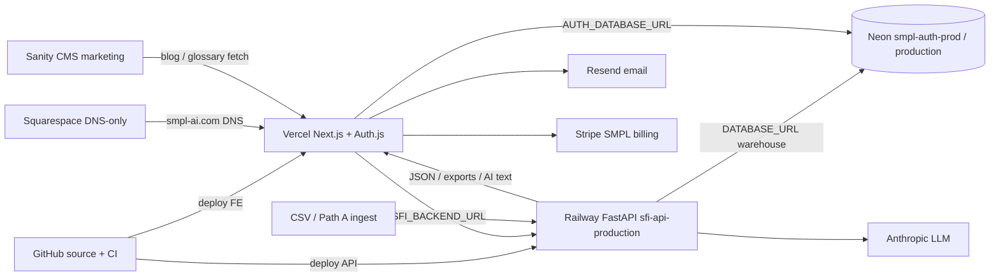
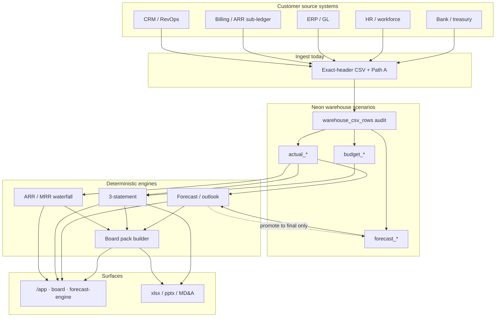
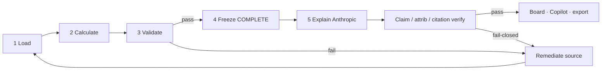
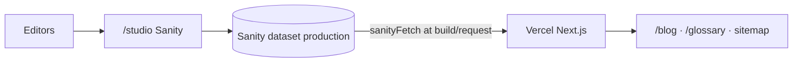

# SMPL.ai build-out maps

Visual companions for the production architecture. Prefer the live Cursor canvases for reading; this file keeps **Mermaid** copies in-repo for PRs and offline review.

**Canvases (open beside chat):**

| Map | Canvas |
|-----|--------|
| 1 · System / infra | `smpl-system-infra-map.canvas.tsx` |
| 2 · Platform data | `smpl-platform-data-map.canvas.tsx` |
| 3 · Validation / trust | `smpl-validation-trust-map.canvas.tsx` |

Sources verified against: `Architecture_Master.md`, `Data_Model.md`, `ENVIRONMENTS.md`, `GO_LIVE_PROD_DEPLOY.md`, `soc2/01_system_boundary.md`, `soc2/02_subprocessors.md`, `INTEGRATIONS_SETUP.md`, `CLOSE_PEAK_WORKLOAD.md`, `WAREHOUSE_GATE_NEAR_TERM_PLAN.md`, `P15`.

---

## Map 1 — System / infra (production)

**Notes**

- Canonical web: `www.smpl-ai.com` (Vercel). API: `sfi-api-production.up.railway.app`.
- Auth + warehouse share Neon project `smpl-auth-prod` / branch `production` (AWS us-east-1).
- Squarespace = DNS only (not app host). Sanity = marketing CMS, outside Type I Customer Data boundary.
- OpenAI: code fallback exists; **not live** on prod Railway. Render blueprint = optional; prod API is Railway.
- Native source connectors = roadmap; today CSV + white-glove Path A.

---

## Map 2 — Platform data

**Actuals vs forecast:** closed periods in `actual_*` (+ demo ops tables); forward plan in `forecast_*` / drivers; `Combined` = Actual through close month then Forecast. SoTs: ARR ← MRR waterfall; cash ← cash bridge; billings/rev-rec ← deferred waterfall; pipeline ← pipeline waterfall.

**Forecast modeler feedback:** live levers = in-session overlay (no `forecast_*` write). Drafts = `forecast_versions` JSON. **Promote to Final** writes generated rows into physical `forecast_*` and sets the org active forecast version. Board freeze packs ≠ live lever state.

---

## Map 3 — Validation / trust (calculate → validate → explain)

**Where gates live**

| Stage | Behavior |
|-------|----------|
| Load / close | Hard identification for production actuals |
| Calculate | Deterministic engines / warehouse / freeze — same numbers for UI + export |
| Validate | Tie-outs ($1 actuals); period/scenario scoped |
| Freeze | COMPLETE pack with as-of; STALE labeled; no partial blobs |
| Explain | Anthropic narrates evidence only; keys on Railway |
| Post-LLM | claim / attribution / citation verify on wired paths |
| Export | Optional `block_on_failure` → HTTP 409; export-time client A–F advisory |

---

## Map 4 — Blog / marketing publish (compact)

Marketing content does **not** flow into the FI warehouse. Product FI path remains GitHub → Vercel/Railway → Neon.

---

## Gaps / verify labels

| Topic | Status |
|-------|--------|
| Squarespace | Confirmed DNS-only for `smpl-ai.com` |
| Sanity | Confirmed marketing CMS; outside product Customer Data DPA |
| Neon AUTH vs warehouse | Same project/branch in prod docs; separate projects not required |
| Vendor regions (Vercel, Railway, Resend, Anthropic, Stripe) | TBD except Neon us-east-1 |
| Native connectors (Maxio, etc.) | Not GA — scaffold / partnership / sandbox |
| OpenAI on prod | Not live |
| Full warehouse SQL tie-out report / every DOM citation | Near-term / OPEN vs normative framework |
| Render | Repo blueprint only; production API is Railway |

Do not invent regions or claim native connectors are live.
