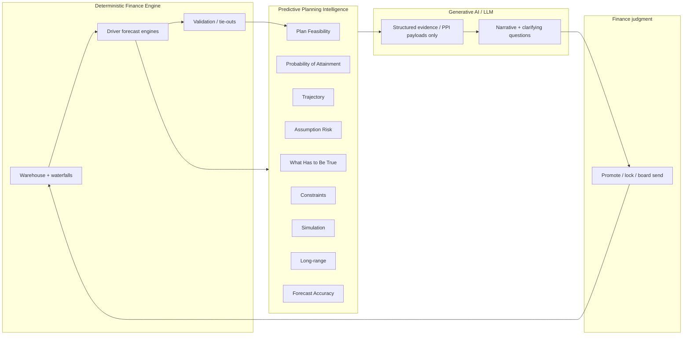

# SMPL.ai Predictive Planning Intelligence Framework

> **Status:** Architecture + phased plan, **now partly implemented**. Phase 1 backend (constraints, feasibility, What Has to Be True) and a client-side Phase 3 simulation are shipped. Phases 2, 4 and 5 remain unbuilt. See §0.1.  
> **Audience:** Product, eng, founder alignment — not marketing.  
> **Related:** [SMPL_Budget_Methodology.md](./SMPL_Budget_Methodology.md) · [SMPL_Agent_and_Predictive_Analytics_Checklist.md](./SMPL_Agent_and_Predictive_Analytics_Checklist.md) · [Forecasting_Assumptions.md](../Forecasting_Assumptions.md) · [Architecture_Master.md](../Architecture_Master.md) · [AI_SKILL_PRACTICES.md](../AI_SKILL_PRACTICES.md) · [Reporting_Logic.md](../Reporting_Logic.md)

**Last updated:** 2026-09-08 (was 2026-08-28 — plan-only)

---

## 0.1 Reconciliation — what shipped, and out of order (2026-09-08)

This document was written plan-first on 2026-08-28 and told the team not to build any engines yet. **Product moved anyway.** Plan Assurance shipped 09-04 → 09-07 (PRs #140/#142) and Phase 1 backend landed 09-08. Read this section before trusting any "Missing" or "Do not implement" label below.

### Phase order was not followed

| Phase | Plan said | What actually happened |
|-------|-----------|------------------------|
| **Phase 1** — constraints, feasibility, WHTT | Build first, "boring and high-trust" | Behaviour shipped inside the Budget Engine as inline JS checks; the *objects* (registry, WHTT artifact, DTO, API) landed **after** Phase 3 |
| **Phase 2** — PoA, trajectory, assumption risk | Second | **Not built.** Sensitivity curves exist in the Budget Engine but there is no ranked assumption-risk object, no trajectory service, no calibrated PoA |
| **Phase 3** — simulation | Third, explicitly "resist jumping to Monte Carlo for demos" | **Shipped first.** 1,000-draw Monte Carlo through the Budget formula graph |
| **Phase 4/5** — forecast accuracy, learning, Act loop | Later | Not built |

Watch-out #3 in §6 ("resist jumping to Monte Carlo for demos") was overtaken by a demo deadline. That is a real inversion, not a documentation error: **simulation is running on top of a constraint layer that was only formalized afterwards.**

### The divergence that still matters: two implementations of one rule set

Plan Assurance shipped as **client-side JavaScript** in `frontend/public/budget-engine/index.html`, not as the `predictive_planning/` Python package §4.1 specifies. Consequences that are still live:

- **Thresholds exist in two places.** `runBudgetRiskChecks` (JS) and `app/services/predictive_planning/feasibility.py` (Python) encode the same 15 rules. The Python defaults were extracted from the JS and are pinned by `tests/test_predictive_planning.py`. **Change one, change both** — there is no shared source yet.
- **Assessments are not persisted.** Nothing is keyed by `(organization_id, forecast_version_id, as_of)`, so no assessment is citable in a board package or comparable across versions. The API returns `persisted: false` and flags transient assessments in `method_notes`.
- **Not keyed to a promoted plan version.** Feasibility runs against whatever the Budget Engine currently holds in memory. The DTO accepts `forecast_version_id` / `budget_version_id`; the Budget Engine does not yet send one.
- **Monte Carlo runs in the browser.** It cannot be reproduced server-side or attached to an export.

### Phase 1 objects now built (2026-09-08)

| Deliverable | Status | Where |
|-------------|--------|-------|
| Constraints registry (tenant + version overlay) | **Shipped** | `app/services/predictive_planning/constraints.py` — 15 constraints, declarative params, precedence: version → tenant → packet → default |
| Feasibility runner (pass / warn / fail) | **Shipped** | `feasibility.py` — parity with the JS checks; missing inputs report `skipped`, never `pass` |
| What Has to Be True generator | **Shipped** | `what_has_to_be_true.py` — `must_close` / `must_confirm` / `must_hold` conditions with levers and rationale; stress breaks map to `must_hold` |
| Assessment DTO + additive API | **Shipped** | `app/schemas/predictive_planning.py`, `app/api/predictive_planning_routes.py` — `GET /api/v1/predictive-planning/constraints`, `POST /api/v1/predictive-planning/assess` |
| Wire to forecast version | **Partial** | DTO accepts a version id; no caller supplies one and nothing is stored |
| Assessment persistence | **Missing** | Needs model + migration. **This is the next Phase 1 step, not a Phase 2 item.** |

### Naming discipline (unchanged and now load-bearing)

Monte Carlo output is **stress frequency under stated priors** — `P(breach | lever noise)`. It is **not** calibrated Probability of Attainment, because Phase 2 calibration does not exist. The simulation is real; the label must stay honest.

---

## 0. Critical product principle (preserve verbatim)

**Most planning software helps Finance build the plan. Predictive Planning Intelligence should help Finance determine whether the business can actually deliver it.**

Operating progression:

**Plan → Test → Observe → Reassess → Act**

Layer separation (non-negotiable):

| Layer | Owns | Does not own |
|-------|------|--------------|
| **Deterministic Finance Engine** | Waterfalls, statements, drivers → schedules, tie-outs, scenario Actual/Budget/Forecast/Combined | Probabilistic attainment, narrative |
| **Predictive Planning Intelligence (PPI)** | Feasibility, probability, trajectory, assumption risk, constraints, simulation, forecast accuracy, structured “what has to be true” | Inventing dollars; rewriting SoT waterfalls |
| **Generative AI / LLM** | Explains structured PPI + finance payloads in plain language; proposes questions / diffs for human approval | Computing financial numbers or silent driver edits |
| **Finance judgment** | Accepts plan changes, locks forecasts, ships board packages | Replaced by model confidence |

---

## 1. Where PPI sits



**Rule:** The LLM consumes **structured payloads only** (finance bundle + PPI outputs + `_sources`). Same posture as commentary evidence packages today — extend, do not bypass.

---

## 2. Capability catalog (product concept)

| Capability | Question it answers | Typical methods (direction) |
|------------|---------------------|----------------------------|
| **Plan Feasibility** | Can the operating system (pipeline, capacity, cash, hiring) support this plan under stated constraints? | Constraint checks, coverage vs quota, cash runway vs plan burn, headcount vs GTM capacity |
| **Probability of Attainment** | How likely is the plan (or a KPI) to be hit? | Historical conversion, calibrated win rates, later: distributions / hybrid |
| **Trajectory** | Are we tracking toward the plan or diverging? | Plan vs forecast vs actual path; slope / catch-up required |
| **Assumption Risk** | Which drivers, if wrong, break the plan first? | Sensitivity ranks; later: tornado / elasticities |
| **What Has to Be True** | Explicit conditions the plan implicitly requires | Derived thresholds from drivers + constraints (e.g. “need X pipeline coverage by M”) |
| **Constraints** | Hard bounds Finance / ops will not cross | Min cash, max burn, hiring freeze, quota capacity, debt covenants (when modeled) |
| **Simulation** | Range of outcomes under uncertain drivers | Monte Carlo / scenario trees on **driver inputs**; outputs remain reconciliable schedules |
| **Long-range** | Multi-year path beyond the rolling forecast horizon | Deterministic long-range case + PPI overlays; still roll-forward from Actual |
| **Forecast Accuracy** | How good were prior forecasts vs Actual? | Bias, MAPE/WAPE by metric & horizon; feeds learning |
| **Hybrid methods** | Blend rules, stats, and (later) customer-specific models | Start simple; graduate only where accuracy proves value |
| **Customer-specific learning** | Improve priors from *this* tenant’s history | Per-org win rates, driver priors, accuracy scores — never cross-tenant leakage |

---

## 3. Inspection of what already exists (do not rebuild)

### 3.1 Map: existing → architecture layer

| Existing capability | Code / docs home | Maps to | Reuse? |
|---------------------|------------------|---------|--------|
| Actual / Budget / Forecast / Combined scenarios | `Architecture_Master` §2; warehouse `actual_*` / `budget_*` / `forecast_*` | **Deterministic** scenario spine | **Reusable** — keep as SoT labels; do not overload “scenario” to mean Monte Carlo draw |
| Driver → waterfall → BS/CF forecast chain | `backend/app/services/driver_forecast/*`; [Forecasting_Assumptions.md](../Forecasting_Assumptions.md) | **Deterministic Finance Engine** | **Reusable** — PPI must *test* these outputs, not replace them |
| Forecast draft / promote / active version | `forecast_version_service.py`, `forecast_version_routes.py` | **Deterministic** plan lifecycle (**Plan**) | **Reusable** — PPI attaches assessments to a version_id |
| Forecast engine shared payload | `forecast_engine_routes.py` → `build_shared_reporting_payload` | Payload backbone for LLM + PPI | **Reusable** |
| GAAP revenue forecast from deferred / bookings | `gaap_revenue_forecast_service.py` | **Deterministic** | **Reusable** |
| Bookings forecast methods + conservative/base/upside multipliers | `bookings/engine.py` (`WEIGHTED` / `STAGE_ADJUSTED` / `HISTORICAL`, `ScenarioFactors`) | Partial **Probability of Attainment** + crude **Simulation** proxy for *bookings only* | **Reusable seed** — rename/clarify in docs/UI so “scenarios” ≠ warehouse Scenario; graduate to calibrated PoA later |
| Opportunity `probability` × amount | Billing forecast, waterfall attribution, bookings | CRM deal weighting — **not** plan PoA | **Reusable input** to PoA; **conflict if** treated as plan attainment |
| Forecast confidence + pipeline coverage | `bookings/metrics.py`, KPIs, board package | Early **Feasibility** / coverage signals | **Reusable** Phase 1 inputs |
| Quota attainment rows (reporting) | Board package / commentary schemas | **Observe** vs plan (rep/segment) | **Reusable** observation feed |
| Workforce / GTM quota capacity validation | `workforce/*` | **Constraints** + capacity feasibility | **Reusable** Phase 1 |
| MRR dry-run (no write) | `mrr_routes` what-if dry-run | Lightweight **Test** hook | **Reusable** pattern for PPI dry assessments |
| Validation catalog + fail-closed export | `Reporting_Logic`, export validation | Deterministic trust gate before Act | **Reusable** — PPI never weakens `$1` fail-closed |
| LLM commentary + claim-verify + evidence packages | `commentary/*`, [AI_SKILL_PRACTICES.md](../AI_SKILL_PRACTICES.md), P15 | **Generative AI** layer correctly bounded | **Reusable** — PPI payloads plug into same pattern |
| Checklist §5 “deterministic base first” | [SMPL_Agent_and_Predictive_Analytics_Checklist.md](./SMPL_Agent_and_Predictive_Analytics_Checklist.md) | Product guardrail aligned with PPI | **Extend** with Phase 1 checklist |

### 3.2 Missing (relative to full PPI)

> **Updated 2026-09-08.** Several rows below were "Missing" on 08-28 and are now shipped. See §0.1 for the divergence between the shipped JS implementation and this module plan.

| Capability | Status |
|------------|--------|
| Plan Feasibility service (cross-domain constraint pack) | **Shipped** — `feasibility.py`, 15 constraints. **Partial:** runs on a supplied packet, not yet on a promoted forecast version |
| Probability of Attainment for plan-level KPIs (ARR, bookings, cash, EBITDA) | **Missing** (bookings confidence ≠ plan PoA; Monte Carlo breach frequency ≠ PoA) |
| Trajectory vs Budget/Forecast path with “catch-up required” | **Missing** as first-class object (variance slides exist; not PPI trajectory) |
| Assumption Risk / sensitivity ranking across `forecast_driver_assumptions` | **Partial** — Budget Engine renders sensitivity curves; no ranked assumption-risk object |
| Structured **What Has to Be True** artifact | **Shipped** — `what_has_to_be_true.py` |
| First-class **Constraints** registry (min cash, coverage floor, hiring freeze, …) | **Shipped** — `constraints.py` with tenant + version overlay |
| Monte Carlo / stochastic simulation engine | **Shipped, client-side only** — 1,000 draws in the Budget Engine; not reproducible server-side |
| Long-range (multi-year) PPI overlay | **Missing** |
| Forecast Accuracy store (prior forecast version vs Actual by metric/horizon) | **Missing** |
| Customer-specific learning loop (priors from accuracy) | **Missing** |
| Dedicated PPI API namespace / schemas | **Shipped** — `/api/v1/predictive-planning/*` |
| Assessment persistence keyed to a plan version | **Missing** — blocks citing an assessment in a board package |

### 3.3 Conflicts & naming traps

1. **“Scenario” overload** — Warehouse Scenario = Actual/Budget/Forecast. Bookings `ScenarioFactors` = conservative/base/upside multipliers. Monte Carlo “scenarios” would be a third meaning. **Fix:** keep warehouse Scenario; call bookings bands **outlook bands**; call simulation draws **trials** / **paths**.
2. **CRM probability ≠ Probability of Attainment** — Deal `probability` is a sales input. Plan PoA is a calibrated statement about hitting the *plan*. Mixing them in UI copy breaks trust.
3. **LLM vs numbers** — Architecture already says AI does not compute figures. Any “AI forecast” feature that writes drivers without approval **conflicts** with [Forecasting_Assumptions.md](../Forecasting_Assumptions.md) AI guardrails and this framework.
4. **Predictive vs validation** — Partner language sometimes treats “predictive analytics” as scenario exploration. Exploration is additive **after** tie-outs; it must not become an alternate fact base.

### 3.4 Where deterministic / predictive / LLM are mixed today

| Area | Mix risk | Clean separation |
|------|----------|------------------|
| Bookings confidence / coverage | Heuristic “confidence” lives next to deterministic bookings totals | Keep engine pure; expose confidence as PPI-lite DTO with method label |
| Board narrative mentioning “forecast confidence” | Prose can imply statistical PoA | Narrative only after structured PPI field exists; claim-verify numbers |
| Driver assumptions + OpenAI “suggest” | Doc allows suggestions; no silent writes | Diff → human approve → deterministic regenerate |
| Checklist §5 | Correct intent, thin on PPI surfaces | This doc + Phase 1 checklist items |

---

## 4. Proposed clean separation

### 4.1 Module boundaries (target)

```
Deterministic Finance Engine     Predictive Planning Intelligence      Generative AI
─────────────────────────────    ─────────────────────────────────     ────────────
driver_forecast/*                predictive_planning/ (new)            commentary/*
waterfall_*, FS, KPIs              feasibility.py                      evidence packages
forecast_version_*                 attainment.py                       claim_verify
validation catalog                 trajectory.py                       LLM factory
reporting payloads                 assumption_risk.py
                                   constraints.py
                                   what_has_to_be_true.py
                                   simulation.py          (Phase 3+)
                                   forecast_accuracy.py   (Phase 4+)
                                   learning/              (Phase 4+)
```

**Contract:** PPI reads **immutable snapshots** of a forecast version + Actual history + constraints. PPI **writes** assessment artifacts (JSON / tables keyed by `organization_id`, `forecast_version_id`, `as_of`). PPI **never** mutates waterfall SoT. Regenerating a plan remains a deterministic engine job after Finance accepts changes.

### 4.2 Payload shape (LLM-facing)

PPI assessment object (conceptual):

- `plan_ref` — org, forecast_version_id, scenario, period range  
- `feasibility` — pass/warn/fail + constraint results  
- `probability_of_attainment` — metric → {p, method, calibration_note}  
- `trajectory` — path vs plan + required run-rate  
- `assumption_risk` — ranked drivers  
- `what_has_to_be_true` — list of explicit conditions  
- `simulation_summary` — optional bands (Phase 3+)  
- `forecast_accuracy` — optional trailing scores (Phase 4+)  
- `_sources` — same discipline as commentary evidence  

LLM may narrate **only** fields present in this object + finance evidence package.

### 4.3 Backward compatibility

- No change to waterfall SoT, validation tolerances, or export fail-closed behavior.  
- Existing bookings conservative/base/upside APIs remain; document as outlook bands.  
- New PPI routes additive (`/api/v1/predictive-planning/...` or similar).  
- UI: progressive disclosure — close/board paths unchanged until Finance opts into PPI surfaces.  
- Do not rename warehouse Scenario enums.

---

## 5. Phased implementation plan (before major structural changes)

> ~~**Do not implement Phase 1–4 engines in this pass.** Ship docs + checklist first.~~ **Superseded 2026-09-08.** Phase 3 shipped client-side and Phase 1 backend has landed. This guidance is retained only as a record of the original sequencing intent — see §0.1.

### Phase 1 — Test the plan (Feasibility, Constraints, What Has to Be True)

**Goal:** Answer “can we deliver this plan?” with deterministic tests on an existing forecast version.

| Deliverable | Status | Notes |
|-------------|--------|--------|
| Constraints registry (tenant + version overlay) | **Shipped** | 15 constraints across ARR, retention, liquidity, sales capacity, GTM, headcount, P&L. Overlay precedence: version → tenant → packet → registry default |
| Feasibility runner | **Shipped** | Emits pass/warn/fail/advisory + skipped. Currently reads a supplied plan packet rather than calling driver_forecast / bookings / workforce directly |
| What Has to Be True generator | **Shipped** | `must_close` (fail), `must_confirm` (warn/advisory), `must_hold` (holds today, breaks under stress) with levers + rationale |
| API + schema | **Shipped** | Assessment DTO; no LLM in the path |
| Wire to forecast version | **Partial** | DTO accepts `forecast_version_id` / `budget_version_id`; the Budget Engine does not yet send one |
| **Assessment persistence** | **Missing — next step** | Needs a model + migration keyed by `(organization_id, forecast_version_id, as_of)`. Until then no assessment is citable or comparable |
| **Single source for thresholds** | **Missing — next step** | Rules are duplicated in JS and Python (§0.1). Fix by having the Budget Engine call `/assess` instead of computing checks locally |
| Checklist | See Agent checklist §7 | |

**Reuse:** coverage ratio, forecast confidence inputs, workforce GTM validation, cash bridge ending cash, MRR dry-run pattern.  
**Out of scope:** Monte Carlo, ML priors.

**Exit criteria:** FP&A can run feasibility on a promoted forecast and get a structured WHTT list without changing a single waterfall row.

### Phase 2 — Observe path risk (Probability of Attainment, Trajectory, Assumption Risk)

| Deliverable | Notes |
|-------------|--------|
| Trajectory service | Budget/Forecast vs Actual path; catch-up ARR/bookings/cash |
| Plan-level PoA v0 | Calibrated from tenant history where available; else transparent heuristic with method tag (never silent CRM probability) |
| Assumption Risk v0 | One-at-a-time driver shocks on deterministic regenerate (sensitivity), ranked by plan KPI impact |
| LLM narrative adapter | Optional: PPI payload → evidence package extension |

**Reuse:** bookings historical win rates, quota attainment observation, variance export patterns.  
**Exit criteria:** Board-ready *structured* PoA/trajectory/risk objects; prose optional and claim-verified.

### Phase 3 — Simulation

| Deliverable | Notes |
|-------------|--------|
| Driver-level simulation | Sample uncertain drivers; each trial runs **deterministic** schedule builders |
| Summary bands | p10/p50/p90 (or conservative/base/upside derived from trials) for selected KPIs |
| Performance guards | Async job; trial budget; never in fail-closed export hot path unless cached |

**Reuse:** `driver_forecast` engines as the trial kernel.  
**Exit criteria:** Simulation summary attaches to assessment; waterfalls for “base case” remain the certified plan.

### Phase 4 — Forecast Accuracy + customer-specific learning

| Deliverable | Notes |
|-------------|--------|
| Accuracy store | Snapshot forecast version vs later Actual by metric & horizon |
| Bias / error metrics | Feed PoA calibration and driver priors |
| Learning loop | Per-org only; documented retention; no cross-tenant training by default |

**Exit criteria:** PoA methods cite accuracy basis; Finance can see “we miss new ARR by X% at 1-month horizon.”

### Phase 5 — Long-range + hybrid methods + Act loop polish

| Deliverable | Notes |
|-------------|--------|
| Long-range cases | Multi-year deterministic spine + PPI overlays |
| Hybrid method registry | Rules / historical / simulation / learned — explicit per metric |
| Observe → Reassess → Act UX | Diff proposals into driver assumptions; promote version; re-run Phase 1–2 |

**Exit criteria:** Full progression **Plan → Test → Observe → Reassess → Act** is productized without collapsing layers.

---

## 6. Alignment verdict (for founders)

| Framework element | Aligns with SMPL today? | Note |
|-------------------|-------------------------|------|
| Deterministic engine as base | **Yes** | Core product strength |
| PPI between engine and LLM | **Yes** | Phase 1 module built 09-08; LLM narrates structured findings only |
| LLM structured payloads only | **Yes** | Commentary/P15 already enforce |
| Plan → Test → Observe → Reassess → Act | **Partial** | Plan/validate/export strong; **Test** now real (feasibility + WHTT + stress); **Observe** still weak — no trajectory or accuracy store |
| Help Finance know if business can deliver | **Strategic fit** | Differentiator vs “another planning grid” |
| Phases 1–5 | **1 shipped, 3 shipped client-side, 2/4/5 open** | Order was inverted — see §0.1 |

**Pushback / watch-outs (constructive):**

1. Do not market bookings “confidence” — or Monte Carlo breach frequency — as Probability of Attainment until Phase 2 calibration exists.  
2. Do not let simulation write alternate SoT waterfalls — trials inform bands; certified plan stays deterministic.  
3. ~~Phase 1 should be boring and high-trust (constraints + WHTT); resist jumping to Monte Carlo for demos.~~ **This one was not heeded.** Monte Carlo shipped for a demo before the constraint layer was formalized. Phase 1 objects have since caught up, but the remaining debt — duplicated thresholds and unpersisted assessments (§0.1) — is the direct cost of that inversion. Treat it as evidence for holding the line next time, not as a reason to undo working product.  
4. Preserve fail-closed export: PPI warn ≠ validation pass.  
5. **New:** a check that cannot run is not a check that passed. Missing inputs must surface as `skipped`, never as green.

---

## 7. Doc & checklist incorporation

| Artifact | Role |
|----------|------|
| This document | Canonical PPI product architecture + phased plan + shipped-state reconciliation (§0.1) |
| [SMPL_Budget_Methodology.md](./SMPL_Budget_Methodology.md) | The planning cycle PPI tests against — version states, lock calendar, Budget vs Actual cadence |
| [SMPL_Agent_and_Predictive_Analytics_Checklist.md](./SMPL_Agent_and_Predictive_Analytics_Checklist.md) | Day-to-day pre-flight + Phase 1 build checklist + link here |
| [Architecture_Master.md](../Architecture_Master.md) | Doc map entry; service-boundary hook now that the PPI module has landed |
| [Forecasting_Assumptions.md](../Forecasting_Assumptions.md) | Remains deterministic driver SoT; PPI tests assumptions, does not redefine them |
| `backend/app/services/predictive_planning/` | Phase 1 implementation — registry, feasibility, WHTT |
| `backend/tests/test_predictive_planning.py` | Pins JS ↔ Python threshold parity. Treat failures here as a product discrepancy, not a flaky test |

---

## 8. Explicit non-goals (near term)

- Replacing driver_forecast or waterfall SoT with an LLM or black-box ML forecast.  
- Cross-tenant model training without a separate privacy/legal decision.  
- Weakening `$1` tie-out tolerance for “probabilistic” plans.  
- ~~Implementing Phase 1–4 engines in the same change set as this architecture doc.~~ *(Moot — Phase 1 and a client-side Phase 3 are shipped; see §0.1.)*  
- Relabelling Monte Carlo breach frequency as Probability of Attainment without Phase 2 calibration.
