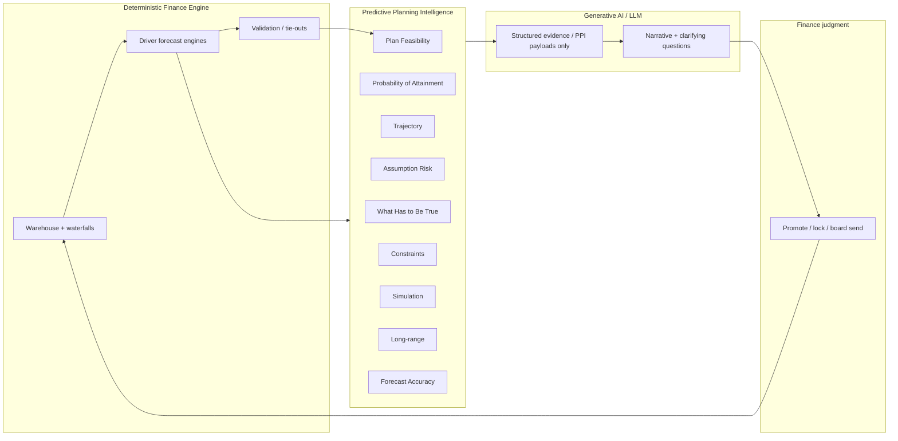

# SMPL.ai Predictive Planning Intelligence Framework

> **Status:** Plan Assurance runs for Budget and Forecast through `/assess` (feasibility, WHTT). Budget simulates the full plan in the browser with server-issued seeded inputs. Forecast uses the server packet model. Assessments persist against the saved version, and Board AI commentary cites the active forecast version's assessment. Calibrated PoA, trajectory, accuracy store and the Act loop are still unbuilt. See §0.1.  
> **Audience:** Product, eng, founder alignment — not marketing.  
> **Related:** [SMPL_Budget_Methodology.md](./SMPL_Budget_Methodology.md) · [SMPL_Agent_and_Predictive_Analytics_Checklist.md](./SMPL_Agent_and_Predictive_Analytics_Checklist.md) · [Forecasting_Assumptions.md](../Forecasting_Assumptions.md) · [Architecture_Master.md](../Architecture_Master.md) · [AI_SKILL_PRACTICES.md](../AI_SKILL_PRACTICES.md) · [Reporting_Logic.md](../Reporting_Logic.md)

**Last updated:** 2026-10-01 (history priors and correlations; server-issued Monte Carlo inputs; version-keyed persistence; Board citation of the active forecast version)

---

## 0.1 Reconciliation — what shipped, and out of order (2026-09-08)

This document was written plan-first on 2026-08-28 and told the team not to build any engines yet. **Product moved anyway.** Plan Assurance shipped 09-04 → 09-07 (PRs #140/#142) and Phase 1 backend landed 09-08. Read this section before trusting any "Missing" or "Do not implement" label below.

### Phase order was not followed

| Phase | Plan said | What actually happened |
|-------|-----------|------------------------|
| **Phase 1** — constraints, feasibility, WHTT | Build first, "boring and high-trust" | Behaviour shipped inside the Budget Engine as inline JS checks; the *objects* (registry, WHTT artifact, DTO, API) landed **after** Phase 3 |
| **Phase 2** — PoA, trajectory, assumption risk | Second | **Not built.** Sensitivity curves exist in the Budget Engine but there is no ranked assumption-risk object, no trajectory service, no calibrated PoA |
| **Phase 3** — simulation | Third, explicitly "resist jumping to Monte Carlo for demos" | **Shipped first.** 1,000-draw Monte Carlo through the Budget formula graph |
| **Phase 4/5** — forecast accuracy, learning, Act loop | Later | Not built |

Watch-out #3 in §6 ("resist jumping to Monte Carlo for demos") was overtaken by a demo deadline. That is a real inversion, not a documentation error: **simulation is running on top of a constraint layer that was only formalized afterwards.**

### Platform engine status (2026-10-01)

Plan Assurance is a **platform service** used by Budget and Forecast, with persisted assessments cited in Board AI commentary.

- **Live SoT:** Budget posts `buildBudgetAssurancePacket()` and Forecast posts `buildFcAssurancePacket()` to `POST /api/v1/predictive-planning/assess`. Feasibility severities and WHTT come from Python. `runBudgetRiskChecks` remains an offline fallback only.
- **WHTT UI:** both engines render `must_close` / `must_confirm` / `must_hold` from the assessment artifact.
- **Monte Carlo, Budget:** `POST /mc-inputs` issues the seed, lever priors, applied correlations, sampler id (`mulberry32_box_muller_cholesky_v1`) and an inputs hash. The browser runs 1,000 draws through the full Budget formula graph with exactly those inputs (`/shared/smpl-plan-mc.js`). The same seed and inputs on the same plan reproduce the same results. The server packet model (`/simulate`) runs only if the full-plan engine cannot, and is labeled as the fallback. If `/mc-inputs` is unreachable, the browser uses default priors and the method card says so.
- **Monte Carlo, Forecast:** the server packet model (`/simulate`, seeded) is primary, with a labeled browser packet fallback. It is a simplified packet model, not the full formula graph.
- **Card, chart and record agree:** `/assess` reconciles the priors, seed, correlations, engine and inputs hash the simulation actually used (`reconcile_simulation_priors`). The method card shows the priors used. If they differ from the server's fit, the card says so and claims nothing as fitted.
- **Priors:** `fit_priors_from_history` fits only the ARR growth volatility prior: sd of monthly growth × √12 from closed-month warehouse ending ARR, with at least three growth rates. Cost per lead, sales attrition and pipeline coverage keep defaults (`history_partial`). Demo or backcast data is never fitted. Breach rates are still stress frequency, not PoA.
- **Correlations:** levers are drawn jointly through a Cholesky factor when correlations are supplied, or fitted from at least 12 paired observations. Inconsistent sets are shrunk until valid. No current customer or demo data has 12 pairs, so draws are independent in practice and the card says "Independent draws".
- **Persistence:** `plan_assessments` (`ppi_001`). Saving or promoting a Budget or Forecast version assesses that exact packet, with a fresh simulation, against the new version id. Each engine records a fingerprint of the saved packet. Later assessments are filed under the version only while the packet still matches it. After an edit they are transient until the next save. Re-assessing the same version with the same simulation does not write a duplicate. `/assess` persists only if the version exists and belongs to the organization; otherwise it notes "Not persisted: …".
- **Board citation:** `board_plan_assurance_for_org` cites only the latest assessment persisted against the organization's active final forecast version, because Board figures come from that version. It feeds the AI-regenerated risks and board-actions slides and `BoardPlatformPayload.plan_assurance`. There is no fallback to a budget assessment, and the deterministic Board commentary does not cite Plan Assurance.
- **Known gaps:** predictive-planning routes have no per-user authorization check of their own. The server never rebuilds a packet from a stored version; it assesses the packet the engine supplies (bound to the version by fingerprint). There are no post-lock drift alerts.

### Phase 1 objects (updated 2026-10-01)

| Deliverable | Status | Where |
|-------------|--------|-------|
| Constraints registry (tenant + version overlay) | **Shipped** | `app/services/predictive_planning/constraints.py` (15 constraints) |
| Feasibility runner (pass / warn / fail) | **Shipped — live SoT** | `feasibility.py` via `/assess` |
| What Has to Be True generator + UI | **Shipped** | `what_has_to_be_true.py` + Budget and Forecast WHTT panels |
| Assessment DTO + API | **Shipped** | `/constraints`, `/assess`, `/mc-inputs`, `/simulate`, `/assessments` |
| Assessment persistence | **Shipped — version-validated** | `plan_assessments`; persisted at save/promote and while the packet matches the saved fingerprint |
| Monte Carlo | **Shipped** | Budget: full-plan browser engine on server-issued inputs (`mc_inputs.py`, `smpl-plan-mc.js`). Forecast and fallback: `monte_carlo.py` packet model. Stress frequency under stated priors, not PoA |
| History priors + correlations | **Shipped (ARR growth only on current data)** | `priors.py` + method card; correlations need ≥12 pairs |
| Forecast / Board adapters | **Shipped** | `forecast_adapter.py`; `board_citation.py` cites the active forecast version's assessment |

### Naming discipline (unchanged and now load-bearing)

Monte Carlo output is **stress frequency under stated priors** — `P(breach | lever noise)`. It is **not** calibrated Probability of Attainment, because Phase 2 calibration does not exist. The simulation is real; the label must stay honest.

---

## 0. Critical product principle (preserve verbatim)

**Most planning software helps Finance build the plan. Predictive Planning Intelligence should help Finance determine whether the business can actually deliver it.**

Operating progression:

**Plan → Test → Observe → Reassess → Act**

Layer separation (non-negotiable):

| Layer | Owns | Does not own |
|-------|------|--------------|
| **Deterministic Finance Engine** | Waterfalls, statements, drivers → schedules, tie-outs, scenario Actual/Budget/Forecast/Combined | Probabilistic attainment, narrative |
| **Predictive Planning Intelligence (PPI)** | Feasibility, probability, trajectory, assumption risk, constraints, simulation, forecast accuracy, structured “what has to be true” | Inventing dollars; rewriting SoT waterfalls |
| **Generative AI / LLM** | Explains structured PPI + finance payloads in plain language; proposes questions / diffs for human approval | Computing financial numbers or silent driver edits |
| **Finance judgment** | Accepts plan changes, locks forecasts, ships board packages | Replaced by model confidence |

---

## 1. Where PPI sits


```mermaid
flowchart LR
  subgraph det [Deterministic Finance Engine]
    WH[Warehouse + waterfalls]
    DRV[Driver forecast engines]
    VAL[Validation / tie-outs]
  end

  subgraph ppi [Predictive Planning Intelligence]
    FEAS[Plan Feasibility]
    POA[Probability of Attainment]
    TRAJ[Trajectory]
    ARISK[Assumption Risk]
    WHTT[What Has to Be True]
    CONS[Constraints]
    SIM[Simulation]
    LR[Long-range]
    FA[Forecast Accuracy]
  end

  subgraph gen [Generative AI / LLM]
    EP[Structured evidence / PPI payloads only]
    NAR[Narrative + clarifying questions]
  end

  subgraph human [Finance judgment]
    LOCK[Promote / lock / board send]
  end

  WH --> DRV --> VAL
  VAL --> FEAS
  DRV --> ppi
  ppi --> EP --> NAR
  NAR --> LOCK
  LOCK --> WH
```

**Rule:** The LLM consumes **structured payloads only** (finance bundle + PPI outputs + `_sources`). Same posture as commentary evidence packages today — extend, do not bypass.

---

## 2. Capability catalog (product concept)

| Capability | Question it answers | Typical methods (direction) |
|------------|---------------------|----------------------------|
| **Plan Feasibility** | Can the operating system (pipeline, capacity, cash, hiring) support this plan under stated constraints? | Constraint checks, coverage vs quota, cash runway vs plan burn, headcount vs GTM capacity |
| **Probability of Attainment** | How likely is the plan (or a KPI) to be hit? | Historical conversion, calibrated win rates, later: distributions / hybrid |
| **Trajectory** | Are we tracking toward the plan or diverging? | Plan vs forecast vs actual path; slope / catch-up required |
| **Assumption Risk** | Which drivers, if wrong, break the plan first? | Sensitivity ranks; later: tornado / elasticities |
| **What Has to Be True** | Explicit conditions the plan implicitly requires | Derived thresholds from drivers + constraints (e.g. “need X pipeline coverage by M”) |
| **Constraints** | Hard bounds Finance / ops will not cross | Min cash, max burn, hiring freeze, quota capacity, debt covenants (when modeled) |
| **Simulation** | Range of outcomes under uncertain drivers | Monte Carlo / scenario trees on **driver inputs**; outputs remain reconciliable schedules |
| **Long-range** | Multi-year path beyond the rolling forecast horizon | Deterministic long-range case + PPI overlays; still roll-forward from Actual |
| **Forecast Accuracy** | How good were prior forecasts vs Actual? | Bias, MAPE/WAPE by metric & horizon; feeds learning |
| **Hybrid methods** | Blend rules, stats, and (later) customer-specific models | Start simple; graduate only where accuracy proves value |
| **Customer-specific learning** | Improve priors from *this* tenant’s history | Per-org win rates, driver priors, accuracy scores — never cross-tenant leakage |

---

## 3. Inspection of what already exists (do not rebuild)

### 3.1 Map: existing → architecture layer

| Existing capability | Code / docs home | Maps to | Reuse? |
|---------------------|------------------|---------|--------|
| Actual / Budget / Forecast / Combined scenarios | `Architecture_Master` §2; warehouse `actual_*` / `budget_*` / `forecast_*` | **Deterministic** scenario spine | **Reusable** — keep as SoT labels; do not overload “scenario” to mean Monte Carlo draw |
| Driver → waterfall → BS/CF forecast chain | `backend/app/services/driver_forecast/*`; [Forecasting_Assumptions.md](../Forecasting_Assumptions.md) | **Deterministic Finance Engine** | **Reusable** — PPI must *test* these outputs, not replace them |
| Forecast draft / promote / active version | `forecast_version_service.py`, `forecast_version_routes.py` | **Deterministic** plan lifecycle (**Plan**) | **Reusable** — PPI attaches assessments to a version_id |
| Forecast engine shared payload | `forecast_engine_routes.py` → `build_shared_reporting_payload` | Payload backbone for LLM + PPI | **Reusable** |
| GAAP revenue forecast from deferred / bookings | `gaap_revenue_forecast_service.py` | **Deterministic** | **Reusable** |
| Bookings forecast methods + conservative/base/upside multipliers | `bookings/engine.py` (`WEIGHTED` / `STAGE_ADJUSTED` / `HISTORICAL`, `ScenarioFactors`) | Partial **Probability of Attainment** + crude **Simulation** proxy for *bookings only* | **Reusable seed** — rename/clarify in docs/UI so “scenarios” ≠ warehouse Scenario; graduate to calibrated PoA later |
| Opportunity `probability` × amount | Billing forecast, waterfall attribution, bookings | CRM deal weighting — **not** plan PoA | **Reusable input** to PoA; **conflict if** treated as plan attainment |
| Forecast confidence + pipeline coverage | `bookings/metrics.py`, KPIs, board package | Early **Feasibility** / coverage signals | **Reusable** Phase 1 inputs |
| Quota attainment rows (reporting) | Board package / commentary schemas | **Observe** vs plan (rep/segment) | **Reusable** observation feed |
| Workforce / GTM quota capacity validation | `workforce/*` | **Constraints** + capacity feasibility | **Reusable** Phase 1 |
| MRR dry-run (no write) | `mrr_routes` what-if dry-run | Lightweight **Test** hook | **Reusable** pattern for PPI dry assessments |
| Validation catalog + fail-closed export | `Reporting_Logic`, export validation | Deterministic trust gate before Act | **Reusable** — PPI never weakens `$1` fail-closed |
| LLM commentary + claim-verify + evidence packages | `commentary/*`, [AI_SKILL_PRACTICES.md](../AI_SKILL_PRACTICES.md), P15 | **Generative AI** layer correctly bounded | **Reusable** — PPI payloads plug into same pattern |
| Checklist §5 “deterministic base first” | [SMPL_Agent_and_Predictive_Analytics_Checklist.md](./SMPL_Agent_and_Predictive_Analytics_Checklist.md) | Product guardrail aligned with PPI | **Extend** with Phase 1 checklist |

### 3.2 Missing (relative to full PPI)

> **Updated 2026-10-01.** Several rows below were "Missing" on 08-28 and are now shipped. See §0.1 for the divergence between the shipped JS implementation and this module plan.

| Capability | Status |
|------------|--------|
| Plan Feasibility service (cross-domain constraint pack) | **Shipped** — `feasibility.py`, 15 constraints. **Partial:** runs on a packet supplied by the Budget or Forecast engine. At save/promote that packet is the saved version's, but the server does not rebuild it from the stored version |
| Probability of Attainment for plan-level KPIs (ARR, bookings, cash, EBITDA) | **Missing** (bookings confidence ≠ plan PoA; Monte Carlo breach frequency ≠ PoA) |
| Trajectory vs Budget/Forecast path with “catch-up required” | **Missing** as first-class object (variance slides exist; not PPI trajectory) |
| Assumption Risk / sensitivity ranking across `forecast_driver_assumptions` | **Partial** — Budget Engine renders sensitivity curves; no ranked assumption-risk object |
| Structured **What Has to Be True** artifact | **Shipped** — `what_has_to_be_true.py` |
| First-class **Constraints** registry (min cash, coverage floor, hiring freeze, …) | **Shipped** — `constraints.py` with tenant + version overlay |
| Monte Carlo / stochastic simulation engine | **Shipped** — Budget: 1,000 seeded draws through the full formula graph in the browser, on server-issued inputs, reproducible from the recorded seed and inputs. Forecast: seeded server packet model. Not calibrated PoA |
| Long-range (multi-year) PPI overlay | **Missing** |
| Forecast Accuracy store (prior forecast version vs Actual by metric/horizon) | **Missing** |
| Customer-specific learning loop (priors from accuracy) | **Missing.** Only the ARR growth volatility prior is fitted from tenant history; no accuracy-driven learning |
| Dedicated PPI API namespace / schemas | **Shipped** — `/api/v1/predictive-planning/*` (no per-user authorization check of its own yet) |
| Assessment persistence keyed to a plan version | **Shipped** — version-validated, fingerprint-bound; Board AI commentary cites the active forecast version's assessment |

### 3.3 Conflicts & naming traps

1. **“Scenario” overload** — Warehouse Scenario = Actual/Budget/Forecast. Bookings `ScenarioFactors` = conservative/base/upside multipliers. Monte Carlo “scenarios” would be a third meaning. **Fix:** keep warehouse Scenario; call bookings bands **outlook bands**; call simulation draws **trials** / **paths**.
2. **CRM probability ≠ Probability of Attainment** — Deal `probability` is a sales input. Plan PoA is a calibrated statement about hitting the *plan*. Mixing them in UI copy breaks trust.
3. **LLM vs numbers** — Architecture already says AI does not compute figures. Any “AI forecast” feature that writes drivers without approval **conflicts** with [Forecasting_Assumptions.md](../Forecasting_Assumptions.md) AI guardrails and this framework.
4. **Predictive vs validation** — Partner language sometimes treats “predictive analytics” as scenario exploration. Exploration is additive **after** tie-outs; it must not become an alternate fact base.

### 3.4 Where deterministic / predictive / LLM are mixed today

| Area | Mix risk | Clean separation |
|------|----------|------------------|
| Bookings confidence / coverage | Heuristic “confidence” lives next to deterministic bookings totals | Keep engine pure; expose confidence as PPI-lite DTO with method label |
| Board narrative mentioning “forecast confidence” | Prose can imply statistical PoA | Narrative only after structured PPI field exists; claim-verify numbers |
| Driver assumptions + OpenAI “suggest” | Doc allows suggestions; no silent writes | Diff → human approve → deterministic regenerate |
| Checklist §5 | Correct intent, thin on PPI surfaces | This doc + Phase 1 checklist items |

---

## 4. Proposed clean separation

### 4.1 Module boundaries (target)

```
Deterministic Finance Engine     Predictive Planning Intelligence      Generative AI
─────────────────────────────    ─────────────────────────────────     ────────────
driver_forecast/*                predictive_planning/ (new)            commentary/*
waterfall_*, FS, KPIs              feasibility.py                      evidence packages
forecast_version_*                 attainment.py                       claim_verify
validation catalog                 trajectory.py                       LLM factory
reporting payloads                 assumption_risk.py
                                   constraints.py
                                   what_has_to_be_true.py
                                   simulation.py          (Phase 3+)
                                   forecast_accuracy.py   (Phase 4+)
                                   learning/              (Phase 4+)
```

**Contract:** PPI reads **immutable snapshots** of a forecast version + Actual history + constraints. PPI **writes** assessment artifacts (JSON / tables keyed by `organization_id`, `forecast_version_id`, `as_of`). PPI **never** mutates waterfall SoT. Regenerating a plan remains a deterministic engine job after Finance accepts changes.

### 4.2 Payload shape (LLM-facing)

PPI assessment object (conceptual):

- `plan_ref` — org, forecast_version_id, scenario, period range  
- `feasibility` — pass/warn/fail + constraint results  
- `probability_of_attainment` — metric → {p, method, calibration_note}  
- `trajectory` — path vs plan + required run-rate  
- `assumption_risk` — ranked drivers  
- `what_has_to_be_true` — list of explicit conditions  
- `simulation_summary` — optional bands (Phase 3+)  
- `forecast_accuracy` — optional trailing scores (Phase 4+)  
- `_sources` — same discipline as commentary evidence  

LLM may narrate **only** fields present in this object + finance evidence package.

### 4.3 Backward compatibility

- No change to waterfall SoT, validation tolerances, or export fail-closed behavior.  
- Existing bookings conservative/base/upside APIs remain; document as outlook bands.  
- New PPI routes additive (`/api/v1/predictive-planning/...` or similar).  
- UI: progressive disclosure — close/board paths unchanged until Finance opts into PPI surfaces.  
- Do not rename warehouse Scenario enums.

---

## 5. Phased implementation plan (before major structural changes)

> ~~**Do not implement Phase 1–4 engines in this pass.** Ship docs + checklist first.~~ **Superseded 2026-09-08.** Phase 3 shipped client-side and Phase 1 backend has landed. This guidance is retained only as a record of the original sequencing intent — see §0.1.

### Phase 1 — Test the plan (Feasibility, Constraints, What Has to Be True)

**Goal:** Answer “can we deliver this plan?” with deterministic tests on an existing forecast version.

| Deliverable | Status | Notes |
|-------------|--------|--------|
| Constraints registry (tenant + version overlay) | **Shipped** | 15 constraints across ARR, retention, liquidity, sales capacity, GTM, headcount, P&L. Overlay precedence: version → tenant → packet → registry default |
| Feasibility runner | **Shipped** | Emits pass/warn/fail/advisory + skipped. Currently reads a supplied plan packet rather than calling driver_forecast / bookings / workforce directly |
| What Has to Be True generator | **Shipped** | `must_close` (fail), `must_confirm` (warn/advisory), `must_hold` (holds today, breaks under stress) with levers + rationale |
| API + schema | **Shipped** | Assessment DTO; no LLM in the path |
| Wire to forecast version | **Shipped** | Budget and Forecast assess the saved packet against the new `budget_version_id` / `forecast_version_id` at draft/promote |
| **Assessment persistence** | **Shipped** | `plan_assessments` (`ppi_001`); `/assess` persists only for an existing version in the same org; `GET /assessments` and `board_plan_assurance_for_org` for citation |
| **Single source for thresholds** | **Shipped** | Budget Analytics/Overview consume `/assess`; `runBudgetRiskChecks` is offline fallback only |
| Checklist | See Agent checklist §7 | |

**Reuse:** coverage ratio, forecast confidence inputs, workforce GTM validation, cash bridge ending cash, MRR dry-run pattern.  
**Out of scope:** Monte Carlo, ML priors.

**Exit criteria:** FP&A can run feasibility on a promoted forecast and get a structured WHTT list without changing a single waterfall row.

### Phase 2 — Observe path risk (Probability of Attainment, Trajectory, Assumption Risk)

| Deliverable | Notes |
|-------------|--------|
| Trajectory service | Budget/Forecast vs Actual path; catch-up ARR/bookings/cash |
| Plan-level PoA v0 | Calibrated from tenant history where available; else transparent heuristic with method tag (never silent CRM probability) |
| Assumption Risk v0 | One-at-a-time driver shocks on deterministic regenerate (sensitivity), ranked by plan KPI impact |
| LLM narrative adapter | Optional: PPI payload → evidence package extension |

**Reuse:** bookings historical win rates, quota attainment observation, variance export patterns.  
**Exit criteria:** Board-ready *structured* PoA/trajectory/risk objects; prose optional and claim-verified.

### Phase 3 — Simulation

| Deliverable | Notes |
|-------------|--------|
| Driver-level simulation | Sample uncertain drivers; each trial runs **deterministic** schedule builders |
| Summary bands | p10/p50/p90 (or conservative/base/upside derived from trials) for selected KPIs |
| Performance guards | Async job; trial budget; never in fail-closed export hot path unless cached |

**Reuse:** `driver_forecast` engines as the trial kernel.  
**Exit criteria:** Simulation summary attaches to assessment; waterfalls for “base case” remain the certified plan.

### Phase 4 — Forecast Accuracy + customer-specific learning

| Deliverable | Notes |
|-------------|--------|
| Accuracy store | Snapshot forecast version vs later Actual by metric & horizon |
| Bias / error metrics | Feed PoA calibration and driver priors |
| Learning loop | Per-org only; documented retention; no cross-tenant training by default |

**Exit criteria:** PoA methods cite accuracy basis; Finance can see “we miss new ARR by X% at 1-month horizon.”

### Phase 5 — Long-range + hybrid methods + Act loop polish

| Deliverable | Notes |
|-------------|--------|
| Long-range cases | Multi-year deterministic spine + PPI overlays |
| Hybrid method registry | Rules / historical / simulation / learned — explicit per metric |
| Observe → Reassess → Act UX | Diff proposals into driver assumptions; promote version; re-run Phase 1–2 |

**Exit criteria:** Full progression **Plan → Test → Observe → Reassess → Act** is productized without collapsing layers.

---

## 6. Alignment verdict (for founders)

| Framework element | Aligns with SMPL today? | Note |
|-------------------|-------------------------|------|
| Deterministic engine as base | **Yes** | Core product strength |
| PPI between engine and LLM | **Yes** | Phase 1 module built 09-08; LLM narrates structured findings only |
| LLM structured payloads only | **Yes** | Commentary/P15 already enforce |
| Plan → Test → Observe → Reassess → Act | **Partial** | Plan/validate/export strong; **Test** now real (feasibility + WHTT + stress); **Observe** still weak — no trajectory or accuracy store |
| Help Finance know if business can deliver | **Strategic fit** | Differentiator vs “another planning grid” |
| Phases 1–5 | **1 shipped, 3 shipped (Budget full-plan in the browser on server-issued inputs; Forecast packet model on the server), 2/4/5 open** | Order was inverted — see §0.1 |

**Pushback / watch-outs (constructive):**

1. Do not market bookings “confidence” — or Monte Carlo breach frequency — as Probability of Attainment until Phase 2 calibration exists.  
2. Do not let simulation write alternate SoT waterfalls — trials inform bands; certified plan stays deterministic.  
3. ~~Phase 1 should be boring and high-trust (constraints + WHTT); resist jumping to Monte Carlo for demos.~~ **This one was not heeded.** Monte Carlo shipped for a demo before the constraint layer was formalized. Phase 1 objects have since caught up. Assessments now persist against versions (2026-10-01); the remaining debt — the JS threshold fallback (`runBudgetRiskChecks`) and a Budget simulation that runs in the browser rather than on the server — is the direct cost of that inversion. Treat it as evidence for holding the line next time, not as a reason to undo working product.  
4. Preserve fail-closed export: PPI warn ≠ validation pass.  
5. **New:** a check that cannot run is not a check that passed. Missing inputs must surface as `skipped`, never as green.

---

## 7. Doc & checklist incorporation

| Artifact | Role |
|----------|------|
| This document | Canonical PPI product architecture + phased plan + shipped-state reconciliation (§0.1) |
| [SMPL_Budget_Methodology.md](./SMPL_Budget_Methodology.md) | The planning cycle PPI tests against — version states, lock calendar, Budget vs Actual cadence |
| [SMPL_Agent_and_Predictive_Analytics_Checklist.md](./SMPL_Agent_and_Predictive_Analytics_Checklist.md) | Day-to-day pre-flight + Phase 1 build checklist + link here |
| [Architecture_Master.md](../Architecture_Master.md) | Doc map entry; service-boundary hook now that the PPI module has landed |
| [Forecasting_Assumptions.md](../Forecasting_Assumptions.md) | Remains deterministic driver SoT; PPI tests assumptions, does not redefine them |
| `backend/app/services/predictive_planning/` | Registry, feasibility, WHTT, Monte Carlo packet model, priors, Monte Carlo inputs, persistence, Forecast adapter, Board citation |
| `backend/tests/test_predictive_planning.py` | Pins JS ↔ Python threshold parity. Treat failures here as a product discrepancy, not a flaky test |
| `backend/tests/test_plan_assurance_*.py` | Priors and correlations, server-issued Monte Carlo inputs and card/record agreement, version-keyed persistence and Board citation |
| `frontend/scripts/verify-plan-assurance-mc.mjs` | Seeded sampler reproducibility, correlation handling, Budget wiring to `/mc-inputs`, version binding and dedupe |

---

## 8. Explicit non-goals (near term)

- Replacing driver_forecast or waterfall SoT with an LLM or black-box ML forecast.  
- Cross-tenant model training without a separate privacy/legal decision.  
- Weakening `$1` tie-out tolerance for “probabilistic” plans.  
- ~~Implementing Phase 1–4 engines in the same change set as this architecture doc.~~ *(Moot — Phase 1 and a client-side Phase 3 are shipped; see §0.1.)*  
- Relabelling Monte Carlo breach frequency as Probability of Attainment without Phase 2 calibration.
